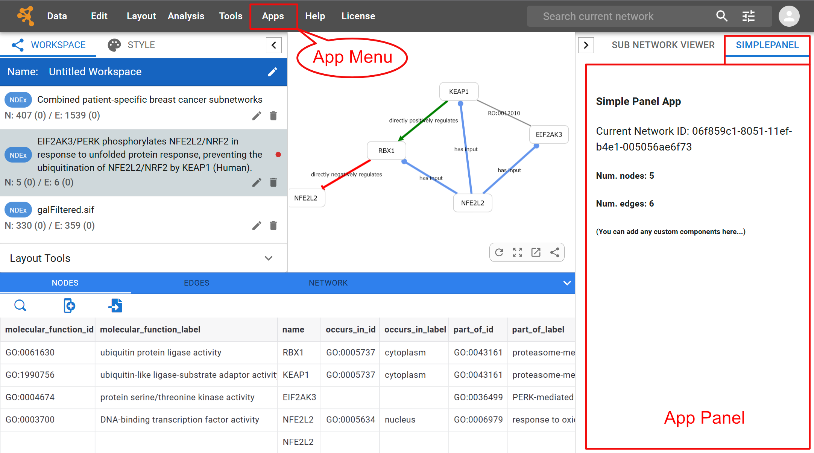

# Apps for _Cytoscape Web_

App developer's guide for Cytoscape Web v1

First release: January 2025

Example Apps:

- https://cytoscape.org/cytoscape-web-app-examples/

## Note

Please be aware that this functionality is in an early stage of
development and may be updated frequently. We appreciate your
understanding and welcome any feedback to help improve the project.

## Introduction

Cytoscape Web has a built-in _App_ hosting mechanism that allows developers to extend its functionality and user interface. This repository contains reference implementations demonstrating basic app development patterns, including:

- Example apps showcasing menu items, panels, and network manipulation
- Detailed explanations of **Module Federation** parameters used in app configuration
- Step-by-step guide for creating new apps using the provided template

Each example includes source code and documentation to help you understand how to:

- Implement custom UI components
- Configure webpack for Module Federation
- Deploy your apps to web servers

Whether you're building your first Cytoscape Web app or looking for implementation patterns, these examples will help you get started quickly.

## Extend Cytoscape Web with Apps



Cytoscape Web has two ways to expand its system.
In this release, Apps can extend Cytoscape Web in two main ways:

### Add Menu Items

- Create new menu items under the "App" menu
- Define custom actions for menu clicks
- Access core data models through menu item handlers

The menu item can implement various types of functionality. For example:

- **Network and Table Data Operations**

  - Create or modify networks
  - Import/export network
  - Manipulate table data

- **Custom Dialog Windows**

  - Show complex parameter input forms
  - Display analysis results

- **External Service Integration**
  - Connect to public database and import data
  - Call web services for network analysis

Beyond these examples, menu can call any custom functionality by creating their own React components and utilizing the core data models exposed by Cytoscape Web.

### Add Panel Components

On the right-hand side of the UI, there are dedicated tabs for adding custom UI panels by Apps (_App Panel_).

- Add custom React components to the App Panel
- Interact with network data and visual styles
- Show any custom visualizations or analysis result side-by-side

Since App Panels are in the collapsible base panel, this is suitable for implementing custom data viewers / editors. For example, if you want to visualize statistics of the selected network using popular JS library such as D3.js, this is a good choice to show it.

Each example app in this repository demonstrates these extension points with practical implementations.

## Overview Of this repository

This repository contains several example apps and utilities organized as follows:

### Example Apps

- **[hello-world/](hello-world/)** - Basic example showing both of menu and panel

  - Components: `MenuExample`, `HelloPanel`
  - Entry point: `hello@http://localhost:2222/remoteEntry.js`
  - Demo: Basic menu and panel functionality

- **[simple-menu/](simple-menu/)** - Example for adding menu items

  - Components: `AppMenuItem`
  - Demonstrates menu integration under App menu

- **[simple-panel/](simple-panel/)** - Example for creating custom panels
  - Components: `SimplePanel`
  - Shows panel creation and network data access

### Developer Resources

- **[project-template/](project-template/)** - Template for creating new apps

  - Contains basic app structure and configuration
  - Ready-to-use webpack and TypeScript setup

- **[docs/](docs/)** - Built examples and documentation
  - Contains compiled versions of each example app
  - Deployment target for GitHub Pages

### Build Configuration

Each app follows a standard structure:

- `src/` - Source code and components
- `package.json` - App configuration and scripts
- `webpack.config.js` - Module Federation setup
- `tsconfig.json` - TypeScript configuration

The apps use Module Federation to integrate with Cytoscape Web as remote modules.

## Quick Start

### Prerequisite

- Node.js (LTS)
- Supported Web Browser
  - Chrome
  - Safari
  - Firefox
  - Edge

### Run Example Apps

To run all of the apps locally, type:

`npm run dev`

## Example Apps

This repository contains three example applications and one project template for creating new apps. Each example demonstrates different aspects of Cytoscape Web app development - from basic menu integration to custom panel creation and network manipulation. The following sections explain how these apps work and their implementation details.

### hello-world

- App ID: hello
- Description: This app adds one menu item (MenuExample) and a panel (HelloPanel).
- Entry Point: hello@http://localhost:2222/remoteEntry.js
- Source: HelloApp.tsx

### simple-menu

- Description: This app adds a menu item under the App menu in the menu bar.
- Source: SimpleMenuApp.tsx

### simple-panel

- Description: This app demonstrates how to add a custom panel to Cytoscape Web.
- Source: SimplePanelApp.tsx

# App Developer's Guide

## How to build and deploy

To build the apps, run:

To deploy the apps, run:

# Create a new App

To create a new app from the project-template:

Copy the project-template folder and rename it to your desired app name.
Update the name and description fields in the package.json file.
Implement your app logic in the src/ folder.
Update the webpack.config.js if necessary.
Build and run your new app using the following commands:
Your new app will be available at http://localhost:2222/remoteEntry.js. ```

## Module Federation Parameters

Module Federation is a mechanism in Webpack that allows multiple independent builds to form a single application. Here are the key parameters:

name: The unique name of the module. This is used to identify the module in the federation.
filename: The name of the output file that will be created for the module. Typically, this is remoteEntry.js.
exposes: An object that defines the modules that are exposed by this build. The keys are the local module names, and the values are the paths to the modules.
remotes: An object that defines the remote modules that this build depends on. The keys are the names of the remote modules, and the values are the URLs to the remote entry files.
shared: An object that defines the shared modules between the builds. This helps to avoid duplication of dependencies and ensures that the same version of a module is used across all builds.

#### Example Configuration

```
module.exports = {
  // ...
  plugins: [
    new ModuleFederationPlugin({
      name: 'app1',
      filename: 'remoteEntry.js',
      exposes: {
        './Component': './src/Component',
      },
      remotes: {
        app2: 'app2@http://localhost:3002/remoteEntry.js',
      },
      shared: {
        react: {
          singleton: true,
          requiredVersion: '^17.0.0',
        },
        'react-dom': {
          singleton: true,
          requiredVersion: '^17.0.0',
        },
      },
    }),
  ],
};
```

## App Patterns

### Create a network

### Add data to the table

### Apply layout

### Modify Visual Style

(TBD)
