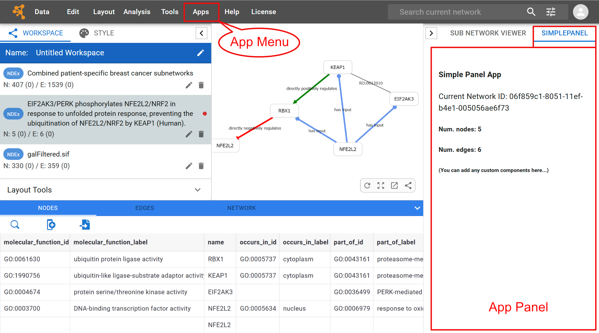

# Apps for _Cytoscape Web_

> Reference implementations for Cytoscape Web app development

- [Live examples](https://cytoscape.org/cytoscape-web-app-examples/)
- [API types package (`@cytoscape-web/api-types`)](https://www.npmjs.com/package/@cytoscape-web/api-types)

---

## Overview

[Cytoscape Web](https://web.cytoscape.org) is a browser-based network visualization and analysis application. Its app system lets you extend the UI and functionality through **Webpack Module Federation** — no modifications to the host application required.

Apps can:

- **Add menu items** — appear under the _App_ menu in the menu bar
- **Add panel components** — appear as tabs in the right-side _App Panel_

This repository provides reference implementations you can use as a starting point.

---

## Quick Start

### Prerequisites

- Node.js (LTS)
- The [Cytoscape Web](https://github.com/cytoscape/cytoscape-web) host running locally on `localhost:5500`

> **Note:** The production Cytoscape Web server loads apps from a curated allowlist.
> If you would like your app listed on the public server, please contact the Cytoscape Web team after your app is ready for review.

### Run all example apps

```bash
npm install
npm run dev   # starts all 3 example apps concurrently
```

### Connect to the host

The host application loads apps from its registry file. To load local dev apps:

```bash
# In the cytoscape-web host repo:
cp src/assets/apps.local.json src/assets/apps.json
npm run dev   # starts host on localhost:5500
```

`apps.local.json` is pre-configured with the dev-server URLs for all example apps in this repository.

---

## App API

All app development uses the **Cytoscape Web App API** — a typed, stable interface exposed by the host via Module Federation.

### Install types

```bash
npm install --save-dev @cytoscape-web/api-types
```

Add to `tsconfig.json`:

```json
{
  "compilerOptions": {
    "types": ["@cytoscape-web/api-types"]
  }
}
```

This gives you full TypeScript types for all API objects, events, and `window.CyWebApi`.

---

### CyAppWithLifecycle — the app entry point

Every app exports a `CyAppWithLifecycle` object as its default export. This declares the app's identity, components, and optional lifecycle callbacks.

```typescript
// src/MyApp.tsx
import {
  CyAppWithLifecycle,
  AppContext,
  ComponentType,
} from '@cytoscape-web/api-types'
import { lazy } from 'react'
import packageJson from '../package.json'

const { version } = packageJson

const MyApp: CyAppWithLifecycle = {
  id: 'myApp', // must match Module Federation `name`
  name: 'My App',
  description: 'What this app does',
  version,
  apiVersion: '1.0',
  components: [
    {
      id: 'MyPanel',
      type: ComponentType.Panel,
      component: lazy(() => import('./components/MyPanel')),
    },
  ],

  mount(context: AppContext): void {
    // Called after the app is registered.
    // context.apis === window.CyWebApi
    console.log(
      'App mounted, network:',
      context.apis.workspace.getCurrentNetworkId(),
    )
  },

  unmount(): void {
    // Called when the app is disabled or unloaded.
    // Clean up all event listeners and timers here.
  },
}

export default MyApp
```

**Entry point** (`src/index.ts`):

```typescript
export { default } from './MyApp'
```

---

### Domain APIs

The host exposes nine domain APIs. Import them as React hooks from the `cyweb/` prefix:

| API              | Import                 | What it does                              |
| ---------------- | ---------------------- | ----------------------------------------- |
| `ElementApi`     | `cyweb/ElementApi`     | Create / read / delete nodes and edges    |
| `NetworkApi`     | `cyweb/NetworkApi`     | Create, delete, and navigate networks     |
| `SelectionApi`   | `cyweb/SelectionApi`   | Get and set selected nodes / edges        |
| `ViewportApi`    | `cyweb/ViewportApi`    | Zoom, pan, and fit the viewport           |
| `TableApi`       | `cyweb/TableApi`       | Read and write node / edge table data     |
| `VisualStyleApi` | `cyweb/VisualStyleApi` | Read and apply visual styles              |
| `LayoutApi`      | `cyweb/LayoutApi`      | Run layout algorithms                     |
| `ExportApi`      | `cyweb/ExportApi`      | Export networks (CX2, SIF, …)             |
| `WorkspaceApi`   | `cyweb/WorkspaceApi`   | Query workspace and current network state |

All API functions return `ApiResult<T>` — a discriminated union that never throws:

```typescript
import { useElementApi } from 'cyweb/ElementApi'
import { useWorkspaceApi } from 'cyweb/WorkspaceApi'

export const MyComponent = () => {
  const elementApi = useElementApi()
  const workspaceApi = useWorkspaceApi()

  const handleCreate = () => {
    const current = workspaceApi.getCurrentNetworkId()
    if (!current.success) return

    const result = elementApi.createNode(current.data.networkId, [100, 200], {
      attributes: { name: 'New Node' },
    })

    if (result.success) {
      console.log('Created:', result.data.nodeId)
    } else {
      console.error(result.error.code, result.error.message)
    }
  }

  return <button onClick={handleCreate}>Add Node</button>
}
```

---

### Event Bus

Subscribe to host events with `useCyWebEvent` (React) or `window.addEventListener` (anywhere):

**React component:**

```typescript
import { useCyWebEvent } from 'cyweb/EventBus'
import { useCallback } from 'react'

export const MyComponent = () => {
  const handleSelection = useCallback(({ networkId, selectedNodes }) => {
    console.log('Selected nodes:', selectedNodes)
  }, [])

  useCyWebEvent('selection:changed', handleSelection)
  return <div>...</div>
}
```

**Lifecycle callback (outside React):**

```typescript
mount(context: AppContext): void {
  this._handler = ({ detail }) => {
    console.log('Switched to network:', detail.networkId)
  }
  window.addEventListener('network:switched', this._handler)
},

unmount(): void {
  window.removeEventListener('network:switched', this._handler)
},
```

Available events:

| Event               | Payload                                       |
| ------------------- | --------------------------------------------- |
| `network:created`   | `{ networkId }`                               |
| `network:deleted`   | `{ networkId }`                               |
| `network:switched`  | `{ networkId, previousId }`                   |
| `selection:changed` | `{ networkId, selectedNodes, selectedEdges }` |
| `layout:started`    | `{ networkId, algorithm }`                    |
| `layout:completed`  | `{ networkId, algorithm }`                    |
| `style:changed`     | `{ networkId, property }`                     |
| `data:changed`      | `{ networkId, tableType, rowIds }`            |

---

### window.CyWebApi — non-React usage

The same API is available on `window.CyWebApi` for browser extensions, scripts, or LLM agent bridges:

```javascript
window.addEventListener('cywebapi:ready', () => {
  const result = window.CyWebApi.workspace.getCurrentNetworkId()
  if (result.success) {
    console.log('Current network:', result.data.networkId)
  }
})
```

---

## Extension Points



### Menu items (`ComponentType.Menu`)

Menu components appear under the _App_ menu. They receive a `handleClose` prop to dismiss the menu after an action:

```typescript
export const MyMenuItem = ({ handleClose }: { handleClose: () => void }) => {
  const networkApi = useNetworkApi()

  const handleClick = () => {
    networkApi.deleteCurrentNetwork()
    handleClose()
  }

  return <MenuItem onClick={handleClick}>Delete current network</MenuItem>
}
```

Register in your `CyAppWithLifecycle`:

```typescript
components: [{ id: 'MyMenuItem', type: ComponentType.Menu }]
```

### Panel components (`ComponentType.Panel`)

Panel components appear as tabs in the right-side App Panel. They receive a `message` prop:

```typescript
export const MyPanel = ({ message }: { message: string }) => {
  const selectionApi = useSelectionApi()
  // ...
  return <Box>...</Box>
}
```

---

## Example Apps

| App                                      | Port | Federation Name    | Demonstrates                                          |
| ---------------------------------------- | ---- | ------------------ | ----------------------------------------------------- |
| [hello-world/](hello-world/)             | 2222 | `hello`            | **Full reference** — lifecycle, all 9 APIs, Event Bus |
| [network-workflows/](network-workflows/) | 7000 | `networkWorkflows` | Menu items, network creation, CX2 import              |
| [project-template/](project-template/)   | 5555 | `createNetwork`    | Boilerplate — start here for new apps                 |

**Recommended reading order:**

1. `project-template/` — understand the minimal structure
2. `hello-world/` — see everything working together with lifecycle and events

---

## Creating a New App

### 1. Copy the project template

```bash
cp -r project-template my-app
cd my-app
```

### 2. Update `package.json`

```json
{
  "name": "@cytoscape-web/my-app",
  "version": "1.0.0"
}
```

### 3. Update `webpack.config.js`

```javascript
const DEV_SERVER_PORT = 6000 // pick an unused port

new ModuleFederationPlugin({
  name: 'myApp', // unique camelCase — must match CyApp.id
  filename: 'remoteEntry.js',
  remotes: { cyweb: cywebUrl },
  exposes: {
    './AppConfig': './src/index.ts',
    './MyPanel': './src/components/MyPanel.tsx',
  },
  shared: {
    react: { singleton: true, requiredVersion: deps.react },
    'react-dom': { singleton: true, requiredVersion: deps['react-dom'] },
    '@mui/material': {
      singleton: true,
      requiredVersion: deps['@mui/material'],
    },
  },
})
```

### 4. Implement your app

Replace the template source files in `src/` with your implementation. Keep the `index.ts → default export` pattern.

### 5. Declare host module types

In `src/remotes.d.ts`, declare any `cyweb/*` modules you import:

```typescript
declare module 'cyweb/ElementApi'
declare module 'cyweb/NetworkApi'
declare module 'cyweb/EventBus'
// add others as needed
```

### 6. Register for local testing

Add an entry to the host's `src/assets/apps.local.json`:

```json
{ "name": "myApp", "url": "http://localhost:6000/remoteEntry.js" }
```

### 7. Verify

```bash
npm install
npm run dev
# check http://localhost:6000/remoteEntry.js loads in browser
```

---

## Local Development

### Start everything

```bash
# Terminal 1 — host (cytoscape-web repo)
npm run dev   # localhost:5500

# Terminal 2 — apps (this repo)
npm run dev   # all 3 apps concurrently
```

Or use the VS Code task: **🚀 Start Both Dev Servers**

### Individual app commands

```bash
npm run dev:hello-world
npm run dev:network-workflows
npm run dev:project-template
```

---

## Deployment

```bash
# Build all apps
npm run build

# Build + copy dist to docs/ (GitHub Pages target)
npm run deploy
```

To list your app in the official Cytoscape Web app registry, open an issue or pull request with your app's metadata and the public URL of your `remoteEntry.js`.

---

## Advanced

### Connecting to external services via postMessage

For panels that need to communicate with an external web app (e.g., a Jupyter notebook), open a child window from a menu item and receive data back via `postMessage`:

```typescript
// Menu component: open external app
const handleOpen = () => {
  window.open('https://your-service.example.com', '_blank')
  handleClose()
}

// Panel component: receive data
useEffect(() => {
  const handler = (event: MessageEvent) => {
    if (event.origin !== 'https://your-service.example.com') return
    const { payload } = event.data
    // process payload ...
  }
  window.addEventListener('message', handler)
  return () => window.removeEventListener('message', handler)
}, [])
```

See [network-workflows/](network-workflows/) for a working example with the `JupyterConnectorPanel`.

---

## ⚠️ Deprecated APIs

The following patterns were used in earlier versions of this repository. They are **still functional** but will be removed in a future release. Migrate to the App API instead.

| Deprecated pattern                                                     | Recommended replacement                                                                     |
| ---------------------------------------------------------------------- | ------------------------------------------------------------------------------------------- |
| `import { useWorkspaceStore } from 'cyweb/WorkspaceStore'`             | `import { useWorkspaceApi } from 'cyweb/WorkspaceApi'`                                      |
| `import { useNetworkStore } from 'cyweb/NetworkStore'`                 | `import { useNetworkApi } from 'cyweb/NetworkApi'`                                          |
| `import { useTableStore } from 'cyweb/TableStore'`                     | `import { useTableApi } from 'cyweb/TableApi'`                                              |
| `import { useVisualStyleStore } from 'cyweb/VisualStyleStore'`         | `import { useVisualStyleApi } from 'cyweb/VisualStyleApi'`                                  |
| `import { useCreateNetworkWithView } from 'cyweb/CreateNetwork'`       | `import { useNetworkApi } from 'cyweb/NetworkApi'`                                          |
| `import { useCreateNetworkFromCx2 } from 'cyweb/CreateNetworkFromCx2'` | `import { useNetworkApi } from 'cyweb/NetworkApi'` — `networkApi.createNetworkFromCx2(...)` |

Direct store access exposes internal implementation details and bypasses the stable API contract. Using the App API ensures forward compatibility as the host evolves.
