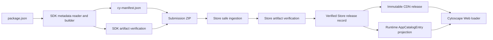

# `cy-manifest.json` proposal review

> Status: Review and decision memo
> Reviewed: 2026-08-25
> Proposal under review: [`cy-manifest.md`](./cy-manifest.md)
> Follow-ups: proposal revision 2 is reviewed in §17; revision 3 is reviewed
> in §18; revision 4 is reviewed in §19; revision 5 is reviewed in §20.
>
> **Latest assessment:** revision 5 resolves most of §19, including the frozen v1
> envelope, one package snapshot, closed archive allowlist, and exact runtime identity.
> It remains suitable for prerelease implementation, but stable promotion still needs
> safe app-id keys, interoperable SemVer ordering, an unambiguous canonical-wire
> validator, and complete SDK release tests. Store adoption and public self-service
> launch remain separate gates; public self-service needs a third gate of its own.

## 1. Executive summary

The proposed direction is sound:

- put a submission manifest at the root of the ZIP archive;
- generate it from `package.json` rather than maintaining another authored file;
- keep the submission manifest as one JSON object while the host catalog remains
  an array;
- omit the deployment URL until the App Store assigns an immutable public URL;
- share one pure manifest builder between ZIP packaging and the CLI.

However, the proposal is not yet a complete SDK-to-Store-to-host contract. The
current App Store, SDK, and host implementations disagree in several important
areas. The most consequential issue is that the current App Store does not accept
an explicit application ID: it derives one from the display name. Adding
`cy-manifest.json` will only solve identity mismatch if the Store adopts the
manifest ID throughout its pending, release, path, and catalog models.

Before implementation, the SDK and App Store teams should agree on these five
items:

1. `cy-manifest.id` is the canonical artifact and Store application ID.
2. ZIP upload and Store-owned GitHub build converge on the same verified release
   record, with an explicit trust and precedence policy.
3. The Store treats the manifest and ZIP as untrusted input and independently
   verifies the actual Module Federation artifact.
4. The mapping from submission manifest to Store record to host catalog is fully
   specified field by field.
5. Publication uses immutable versioned URLs with an explicit CORS, MIME, cache,
   origin, and compatibility contract.

The manifest work can proceed without changing the host catalog schema, but it
must not be presented as making a public self-service App Store safe by itself.
Remote apps still execute in the host JavaScript context and the manifest is not
a sandbox or a provenance mechanism.

## 2. Audit baseline

This review compares the proposal against the following implementations and
design documents.

| Component | Reviewed revision | Relevant sources |
| --- | --- | --- |
| App SDK/examples | `977589ef2a263819d54f45030c47bdad68491b0c` | `packages/app-runtime`, `packages/create-cytoscape-app`, example apps |
| Cytoscape Web host | `6bd1e50733155ea9f039457ef89b6c0e9595154a` | App Manager, App API, runtime catalog types, Store design documents |
| Cytoscape App Store | `ba97c0e216ba60e35812dce61efb16f356cb5545` on `dev` | web bundle submission, storage, pending/release models |

The review is read-only. It does not assume that the proposal itself is already
implemented.

## 3. What the proposal gets right

The following decisions should be retained.

### 3.1 Separate submission and runtime formats

A bare submission object and a runtime `AppCatalogEntry[]` serve different
purposes. Keeping them distinct avoids forcing deployment-only fields such as
`url` into developer-authored metadata. The host parser currently requires a
top-level array, so the Store must perform the projection rather than passing the
submission object directly to the host.

References:

- [`parseManifest.ts`](https://github.com/cytoscape/cytoscape-web/blob/6bd1e50733155ea9f039457ef89b6c0e9595154a/src/features/AppManager/manifest/parseManifest.ts#L41-L47)
- [`classifyInstallPayload.ts`](https://github.com/cytoscape/cytoscape-web/blob/6bd1e50733155ea9f039457ef89b6c0e9595154a/src/features/AppManager/install/classifyInstallPayload.ts#L55-L87)

### 3.2 Keep the deployment URL out of the submitted artifact

The final URL is assigned by the Store and must point to an immutable versioned
release. An artifact-relative `entry` is the appropriate submission-time value.

### 3.3 Use a fixed root location

Requiring exactly one root-level `cy-manifest.json` makes ingestion and review
deterministic. The same rule should apply to the v1 entry point: exactly one
root-level `remoteEntry.js`.

### 3.4 Reuse one pure builder

ZIP generation and `cyweb-app manifest` should call the same pure builder. This
allows byte-equivalence and golden-fixture tests and avoids a second metadata
implementation.

### 3.5 Omit absent optional values

Omitting absent fields is preferable to writing `null`, empty strings, or empty
arrays. Invalid supplied values are different from absent values and should not
be silently omitted.

### 3.6 Do not put submission-only metadata in the browser bundle

Author, repository, and other submission fields do not need to be included in
the runtime virtual metadata module. If the existing `CyWebAppMeta` type is
extended, its exposed-field allowlist must remain unchanged. Prefer a separate
submission metadata type to make that boundary explicit.

Reference:

- [`meta/index.ts`](https://github.com/cytoscape/cytoscape-web-app-examples/blob/977589ef2a263819d54f45030c47bdad68491b0c/packages/app-runtime/src/meta/index.ts#L49-L70)

## 4. Blocking findings

### 4.1 The Store currently derives ID from the display name

The current web bundle form asks for application name, version, author,
description, license, and tags. It has no separate application ID field.

Reference:

- [Current web bundle form](https://github.com/cytoscape/appstore/blob/ba97c0e216ba60e35812dce61efb16f356cb5545/submit_app/views.py#L914-L930)

The Store derives its ID by removing non-word characters and underscores from the
display name and lowercasing the result.

Reference:

- [`fullname_to_name()`](https://github.com/cytoscape/appstore/blob/ba97c0e216ba60e35812dce61efb16f356cb5545/util/id_util.py#L1-L17)

This is incompatible with the SDK contract. For example:

```text
package.json cyweb.id: myApp
form display name:     My App
Store-derived ID:      myapp
```

The host registers the remote using the catalog ID, loads `./AppConfig`, and then
rejects an exported application whose ID does not match.

Reference:

- [`loadRemoteApp.ts`](https://github.com/cytoscape/cytoscape-web/blob/6bd1e50733155ea9f039457ef89b6c0e9595154a/src/features/AppManager/loader/loadRemoteApp.ts#L16-L47)

Required change:

- make `cy-manifest.id` the canonical application ID;
- add an explicit `app_id` to the Store pending/release workflow;
- use it for Store lookup, CDN paths, runtime catalog entries, and update matching;
- make identity fields read-only in the submission review UI;
- reserve `cyweb`, enforce case-sensitive global uniqueness, associate an ID with
  its publisher, and prevent ID changes between versions.

Prefilling the existing form is insufficient because the current persistence and
publication code would still derive a different ID.

### 4.2 The manifest does not prove that the artifact matches it

`cy-manifest.json` is generated from developer-controlled data and can also be
edited after generation. It is useful metadata, but it is not proof of the
contents of `remoteEntry.js`.

The existing SDK verifier checks the generated Module Federation manifest,
container name, `./AppConfig` exposure, shared dependency constraints, and host
resolver behavior.

Reference:

- [`verify.ts`](https://github.com/cytoscape/cytoscape-web-app-examples/blob/977589ef2a263819d54f45030c47bdad68491b0c/packages/app-runtime/src/cli/verify.ts#L149-L288)

However, `mf-manifest.json` is deliberately excluded from the submission ZIP, so
the existing verifier cannot simply be rerun after ZIP extraction.

Reference:

- [`zipForAppStore.ts`](https://github.com/cytoscape/cytoscape-web-app-examples/blob/977589ef2a263819d54f45030c47bdad68491b0c/packages/app-runtime/src/vite/zipForAppStore.ts#L59-L79)

Required verification model:

1. Before packaging, the SDK runs the existing build verification or equivalent.
2. After upload, the Store treats the manifest as untrusted input.
3. In an isolated execution environment, the Store imports `remoteEntry.js`,
   initializes the container, loads `./AppConfig`, and verifies:
   - manifest ID equals the Federation scope/container ID;
   - manifest ID equals exported `CyApp.id`;
   - manifest name and version equal the exported values where those values are
     part of the runtime contract;
   - all transitive chunks can be resolved and loaded;
   - required shared dependencies and host resolvers are valid.
4. Identity mismatches are hard publication failures.

The existing preflight implementation already exercises a remote through
`fetch()` and `import()` and is a better starting point for ZIP verification than
trusting manifest text alone.

Reference:

- [`scripts/preflight-apps.mjs`](https://github.com/cytoscape/cytoscape-web-app-examples/blob/977589ef2a263819d54f45030c47bdad68491b0c/scripts/preflight-apps.mjs#L80-L180)

`generator` should be documented as diagnostic self-reported data, not trusted
provenance.

### 4.3 Safe ZIP ingestion is not specified

The current Store checks the compressed upload size, `.zip` suffix, absolute
paths, and `..` path components. It then accepts any member whose name ends with
`remoteEntry.js`.

Reference:

- [Current ZIP validation](https://github.com/cytoscape/appstore/blob/ba97c0e216ba60e35812dce61efb16f356cb5545/submit_app/views.py#L933-L956)

The publication code reads each expanded member into memory and copies every ZIP
member into the release tree.

Reference:

- [`bundle_storage.py`](https://github.com/cytoscape/appstore/blob/ba97c0e216ba60e35812dce61efb16f356cb5545/submit_app/bundle_storage.py#L37-L69)

The Store cannot assume that every submission was produced by an unmodified SDK.
The ingestion contract must reject at least:

- absolute, drive, UNC, backslash, NUL, and parent-traversal paths;
- normalized duplicate paths and case-folding collisions;
- duplicate `cy-manifest.json` or entry-point members;
- symlinks, hardlinks, devices, FIFOs, and other non-regular files;
- encrypted entries;
- entries outside the approved publication allowlist;
- excessive compressed size, expanded total size, individual file size, entry
  count, compression ratio, path depth, or path length.

Required processing order:

1. inspect every central-directory entry without publishing;
2. normalize and validate all paths and limits;
3. require exactly one root `cy-manifest.json` and exactly one v1 entry point;
4. parse and validate the manifest with bounded memory use;
5. extract to a fresh isolated directory;
6. verify the actual artifact;
7. publish atomically only after all checks pass.

The SDK should also reject symlinks and files whose real path escapes `dist`.

### 4.4 ZIP upload and GitHub build have conflicting authority

The existing App Store design uses a Store-owned build from a public GitHub
repository and immutable ref. It intentionally avoids treating a developer-owned
release asset as the publication source.

Reference:

- [`app-store-design.md`](https://github.com/cytoscape/cytoscape-web/blob/6bd1e50733155ea9f039457ef89b6c0e9595154a/docs/design/module-federation/specifications/app-store-design.md#L165-L205)

The new proposal adds a developer-built ZIP and describes
`cyweb-app manifest --root ...` as part of a GitHub build flow. A manifest command
does not tell Store CI:

- where the application package lives in a monorepo;
- which package manager and lockfile to use;
- which install and build commands to run;
- which output directory to publish;
- which of several applications in one repository is being submitted.

Recommended contract:

- both submission paths converge on one verified Store release record;
- the record stores the Store-computed artifact hash and, when applicable,
  repository URL, immutable commit SHA, application directory, lockfile hash,
  build environment, scanner result, and reviewer decision;
- `app-store.json` is either formally retired or retained only as a build
  descriptor with all overlapping identity fields removed;
- Store CI invokes the lockfile-resolved local SDK binary, not an unpinned latest
  package downloaded with `npx`;
- the trust and review difference between uploaded binaries and Store-built
  artifacts is explicit.

Client-verifiable signatures may remain outside v1, but Store-side hashes and
source/build records should not be deferred. `generator` is not a substitute.

### 4.5 A manifest is not an application security boundary

Remote apps execute in the host's JavaScript context. The host currently exposes
the credential API through Module Federation.

Reference:

- [`federationExposes.ts`](https://github.com/cytoscape/cytoscape-web/blob/6bd1e50733155ea9f039457ef89b6c0e9595154a/src/app-api/federation/federationExposes.ts#L22-L32)

Consequently:

- the manifest feature itself may be implemented without a host schema change;
- a curated Store may use human review and trusted publishers as a current trust
  boundary;
- a public self-service Store requires a separate threat model and host capability
  decision;
- “host unaffected” must not be read as “public Store launch requires no host
  security work.”

This scope distinction should be stated in the proposal's non-goals and rollout
section.

## 5. Recommended three-layer data contract

The proposal currently describes the Store transformation as dropping
`formatVersion`, `entry`, and `generator`, then adding `url`. That is incomplete:

- submission `homepage` is not a host `AppCatalogEntry` field;
- host fields `icon`, `compatibleHostVersions`, and `dependencies` are absent from
  the proposed manifest;
- the current Store bundle projection publishes only a smaller subset of the host
  type.

References:

- [`AppCatalogEntry.ts`](https://github.com/cytoscape/cytoscape-web/blob/6bd1e50733155ea9f039457ef89b6c0e9595154a/src/models/AppModel/AppCatalogEntry.ts#L7-L37)
- [`parseManifest.ts`](https://github.com/cytoscape/cytoscape-web/blob/6bd1e50733155ea9f039457ef89b6c0e9595154a/src/features/AppManager/manifest/parseManifest.ts#L9-L26)
- [Current Store projection](https://github.com/cytoscape/appstore/blob/ba97c0e216ba60e35812dce61efb16f356cb5545/submit_app/bundle_storage.py#L9-L27)

### 5.1 Layer responsibilities

| Layer | Purpose | Examples of fields |
| --- | --- | --- |
| Submission manifest | Artifact identity and developer assertions | `formatVersion`, `id`, `name`, `version`, `type`, `entry`, author metadata |
| Store release record | Source, review, enrichment, and publication state | source/ref, hashes, scanner results, icon, category, homepage, reviewer changes |
| Runtime catalog | Host-consumable allowlist projection | `id`, `type`, `name`, immutable `url`, `author`, compatibility, supported optional fields |

### 5.2 Recommended v1 field policy

| Field | Submission rule | Store rule | Runtime projection |
| --- | --- | --- | --- |
| `formatVersion` | Required integer, exactly `1` | Reject unsupported values | Omit |
| `id` | Required; validated SDK identifier | Canonical, immutable, globally unique, publisher-owned | `id` |
| `name` | Required display value | Reviewer may edit presentation value with audit history | `name` |
| `version` | Required canonical SemVer | Immutable per release; duplicate `{id, version}` rejected | `version` |
| `type` | Required; v1 exactly `client` | Mismatch rejected | `type` |
| `entry` | Required; v1 exactly `remoteEntry.js` | Resolve within version root; exact root member required | Convert to immutable `url` |
| `description` | Optional | Reviewer may edit with audit history | `description` |
| `author` | Optional for ordinary SDK builds; required at Store submission | Publish display name only; retain contact data only with explicit policy | `author` |
| `license` | Optional for ordinary builds | Validate policy; submission may require resolution | `license` |
| `repository` | Optional for ZIP; required/matched for GitHub build | Preserve monorepo directory in Store record | `repository` if supported |
| `homepage` | Optional | Store-only website field | Omit unless host contract is extended |
| `tags` | Optional normalized free tags | Review and keep distinct from Store categories | `tags` |
| `compatibleHostVersions` | Recommended for v1 | Required policy decision; valid SemVer range or rejection | `compatibleHostVersions` |
| `generator` | Generated diagnostic value | Audit hint only; never trusted as provenance | Omit |
| `icon` | Not derived from npm metadata in v1 | Store-owned upload or reviewed artifact | Absolute Store URL if supported |
| `category` | Not an npm keyword projection | Store-controlled vocabulary | Store UI only unless host adds a field |
| `dependencies` | Omit in v1 until activation semantics exist | Do not imply unsupported dependency resolution | Omit |

### 5.3 Precedence and mismatch policy

Do not define one global “form wins” or “manifest wins” rule. Use a field-specific
policy:

- `id`, `version`, `type`, and `entry`: manifest/artifact identity; mismatch is a
  hard rejection;
- `repository` in a GitHub build: must match the repository actually checked out;
- `name`, `description`, and `tags`: reviewer-editable presentation fields, with
  the submitted value and diff retained;
- Store enrichment such as icon and category: Store record is authoritative;
- no Store field may silently rewrite artifact identity.

## 6. Manifest schema and normalization

A TypeScript interface and prose table are insufficient as an inter-team wire
contract. Publish a versioned JSON Schema and run the same golden fixtures in the
SDK and Store.

### 6.1 Required schema decisions

- root value must be one plain JSON object;
- unsupported `formatVersion` is rejected;
- additive unknown optional fields in a supported version are ignored with an
  audit warning;
- field removal, type changes, or semantic changes require a format-version bump;
- duplicate JSON keys are rejected before ordinary object parsing loses them;
- maximum manifest byte size, string lengths, array lengths, and tag counts are
  specified;
- control characters are rejected and display strings are Unicode-normalized;
- invalid supplied values are errors, while absent optional values are omitted;
- a `$schema` hint may be supported, but it does not replace `formatVersion`.

### 6.2 Normalization details

#### Author

- An npm author object should not automatically publish its email address.
- Prefer the author's `name` for the public catalog.
- If multiple maintainers or contact details are needed, model them separately in
  the Store rather than flattening private contact data into one display string.

#### Repository

- Support npm string, object, and recognized shorthand forms explicitly.
- Reject credential-bearing URLs.
- Define whether `git+https`, SSH, query strings, and fragments are accepted.
- Preserve `repository.directory`; it is material for monorepo builds.
- Normalize only after parsing the repository form, not with a pair of string
  replacements.

#### License

- npm metadata may contain an SPDX expression, not only one SPDX identifier.
- Distinguish valid SPDX expressions, `UNLICENSED`, and custom license text that
  requires manual review.
- The scaffolder should not silently make a legal choice for the developer.
  Either ask for an explicit license or leave the project unlicensed until the
  developer chooses one. If MIT is selected, generate the corresponding LICENSE
  file as well as the package field.

#### Tags and categories

- Trim values, remove empty elements, normalize case according to a documented
  rule, de-duplicate, and impose count and length limits.
- Treat npm keywords as candidate free tags only.
- Keep Store-controlled categories separate from developer-provided keywords.

#### URLs

- Accept only documented schemes, normally HTTPS for published URLs.
- Reject embedded credentials.
- Define length, normalization, fragment, and query policies.

#### SemVer

- Reuse one canonical SemVer implementation for SDK input, scaffolder input,
  Store `version`, and `compatibleHostVersions` validation.
- Do not maintain separate regular expressions with different behavior.

## 7. End-to-end lifecycle

The intended lifecycle should be stated explicitly.



Recommended sequence:

1. Read and strictly validate runtime identity and submission metadata.
2. Build the application.
3. Verify the build artifact against the package identity.
4. Create a temporary ZIP with one generated root manifest.
5. Atomically rename the completed ZIP to its final filename.
6. Upload it to the Store.
7. Safely inspect and extract it in an isolated Store environment.
8. Validate the manifest and actual remote artifact independently.
9. Show immutable identity fields and editable presentation fields to reviewers.
10. Persist one verified Store release record with hashes and provenance.
11. Publish to a staging CDN location and run a real browser import test.
12. Atomically promote the immutable release and update mutable catalog pointers.

## 8. CDN and publication contract

### 8.1 URL structure

Use immutable, versioned artifact URLs such as:

```text
https://<artifact-origin>/web/{id}/{version}/remoteEntry.js
```

The same `{id, version}` must never be overwritten. A mutable latest pointer may
exist separately:

```text
https://<catalog-origin>/web/{id}/manifest.json
```

The Store should resolve `entry` with URL semantics against the version root and
verify that the resulting URL remains inside that root.

### 8.2 CORS and MIME

The host registers the remote as `type: 'module'` and loads it with the Module
Federation runtime. Cross-origin ES modules and their transitive imports require
the appropriate CORS response headers.

Reference:

- [`ExternalComponent.tsx`](https://github.com/cytoscape/cytoscape-web/blob/6bd1e50733155ea9f039457ef89b6c0e9595154a/src/features/AppManager/ExternalComponent.tsx#L54-L71)

The CDN contract must cover:

- global and per-app JSON manifests;
- `remoteEntry.js`;
- every transitive JavaScript chunk and required asset;
- correct `Content-Type` values;
- `X-Content-Type-Options: nosniff`;
- HTTPS;
- a browser-based load check from the real host origin.

The existing Store design statement that remote entries and chunks do not need
CORS because they use script-tag injection is stale and should be corrected.

Reference:

- [`app-store-design.md`](https://github.com/cytoscape/cytoscape-web/blob/6bd1e50733155ea9f039457ef89b6c0e9595154a/docs/design/module-federation/specifications/app-store-design.md#L607-L617)

### 8.3 Origin isolation

The current SDK ZIP allowlist includes `index.html` and arbitrary approved asset
paths, while the host only needs the remote entry and its transitive runtime
assets. Publishing arbitrary developer HTML or active assets on the App Store UI
origin unnecessarily expands the Store's cookie and storage trust boundary.

Prefer one of these approaches:

1. publish bundles on a dedicated cookie-less artifact origin; or
2. publish only the runtime dependency closure and explicitly exclude standalone
   HTML from Store releases.

Changing the artifact origin requires a corresponding host origin-allowlist
update.

### 8.4 Cache behavior

- versioned artifacts: long-lived cache with `immutable`;
- global/latest manifests: short TTL or `no-cache` plus ETag;
- publication: atomic switch after staged verification;
- release record: retain the Store-computed checksum even if client-side SRI is
  deferred.

## 9. Compatibility and host impact

The proposal leaves minimum host version as an open question, but the host model
already contains `compatibleHostVersions`.

Reference:

- [`AppCatalogEntry.ts`](https://github.com/cytoscape/cytoscape-web/blob/6bd1e50733155ea9f039457ef89b6c0e9595154a/src/models/AppModel/AppCatalogEntry.ts#L29-L37)

Current gaps:

- missing or invalid ranges are treated as compatible;
- the initial install path performs a compatibility check;
- normal reactivation and startup auto-load paths do not consistently perform the
  same check;
- the exposed App API version exists but is not currently enforced as a separate
  compatibility contract.

References:

- [`installGate.ts`](https://github.com/cytoscape/cytoscape-web/blob/6bd1e50733155ea9f039457ef89b6c0e9595154a/src/features/AppManager/install/installGate.ts#L190-L210)
- [`useAppManager.ts`](https://github.com/cytoscape/cytoscape-web/blob/6bd1e50733155ea9f039457ef89b6c0e9595154a/src/data/hooks/stores/useAppManager.ts#L198-L260)
- [`hostDescriptor.ts`](https://github.com/cytoscape/cytoscape-web/blob/6bd1e50733155ea9f039457ef89b6c0e9595154a/src/app-api/federation/hostDescriptor.ts#L17-L22)

Recommendation:

- add a single authoring source such as `cyweb.compatibleHostVersions`;
- validate it strictly in the SDK and Store;
- include it in the runtime catalog;
- enforce it at every host activation boundary;
- keep host product-version compatibility separate from future App API-version
  compatibility.

Therefore, “host unaffected” is accurate only in the narrow sense that a new
submission object does not require a new host catalog shape. The overall rollout
may still require:

- a Store catalog URL or same-origin proxy;
- artifact-origin allowlist changes;
- consistent compatibility enforcement;
- an update/reload UX decision for already loaded applications.

## 10. SDK implementation gaps

### 10.1 Current metadata reader is narrower than the proposal

The current reader handles `version`, `description`, and
`cyweb.{id,displayName,port}`. It does not yet read all proposed submission fields.

Reference:

- [`appMeta.ts`](https://github.com/cytoscape/cytoscape-web-app-examples/blob/977589ef2a263819d54f45030c47bdad68491b0c/packages/app-runtime/src/vite/appMeta.ts#L33-L107)

The current example packages also generally lack `author`, `license`,
`repository`, `homepage`, and `keywords`. Consequently, warning from the common
metadata reader would make ordinary development and builds noisy.

Recommended separation:

- metadata extraction and manifest building remain pure and silent;
- ordinary development continues to require only runtime identity fields;
- Store packaging and `manifest` commands issue submission-readiness warnings;
- warnings go to stderr so CLI stdout remains valid JSON.

### 10.2 The proposed verification command does not currently exist in examples

The proposal uses:

```sh
npm run build:zip -w hello-world
```

Current examples do not define that script. The ZIP option is off by default;
only newly generated scaffold projects currently receive a `build:zip` script.
Either update every maintained example or change the documented command to the
actual supported invocation.

References:

- [`hello-world/package.json`](https://github.com/cytoscape/cytoscape-web-app-examples/blob/977589ef2a263819d54f45030c47bdad68491b0c/hello-world/package.json#L15-L25)
- [`vite/index.ts`](https://github.com/cytoscape/cytoscape-web-app-examples/blob/977589ef2a263819d54f45030c47bdad68491b0c/packages/app-runtime/src/vite/index.ts#L116-L124)
- [`scaffold.ts`](https://github.com/cytoscape/cytoscape-web-app-examples/blob/977589ef2a263819d54f45030c47bdad68491b0c/packages/create-cytoscape-app/src/scaffold.ts#L206-L251)

### 10.3 The 0.4.0 rollout must update all consumers

The current runtime is `0.3.1`, and generated projects and examples use a
`^0.3.0` range. A `0.x` caret range will not select `0.4.0`.

The release change must update together:

- runtime package version;
- scaffolder package and its generated SDK version;
- all maintained examples;
- lockfile and generated snapshots;
- documentation and release runbook.

### 10.4 ZIP dependencies are not standalone-safe

The runtime declares `adm-zip` as an optional peer. The monorepo root dependency
can hide the fact that generated standalone projects do not explicitly install
it even though they receive a `build:zip` script.

Add an actual freshly generated standalone project test under both the supported
npm layout and any supported pnpm layout. Either generate an explicit dependency
or make ZIP support self-contained in the runtime package.

### 10.5 ZIP output should be atomic and reproducible enough for review

The current packaging flow can leave an old ZIP after a failed build and writes
the final ZIP directly. That creates a stale-artifact submission risk.

Recommended behavior:

- invalidate the known target at packaging start;
- write to a temporary ZIP;
- close and verify the temporary archive;
- atomically rename it to the final filename;
- sort entries and normalize timestamps/modes if stable hashes or reproducible
  review artifacts are desired.

### 10.6 CLI design needs subcommand-specific validation

The current CLI only supports `verify` and has a simple shared flag parser.

Reference:

- [`cyweb-app.ts`](https://github.com/cytoscape/cytoscape-web-app-examples/blob/977589ef2a263819d54f45030c47bdad68491b0c/packages/app-runtime/src/cli/cyweb-app.ts#L15-L54)

For `manifest`, specify and test:

- `--root` resolution in monorepos;
- `--out` behavior and overwrite policy;
- missing argument and unknown flag failures;
- stdout JSON versus stderr diagnostics;
- package-root containment;
- exit codes;
- identical parsed output between CLI and ZIP generation.

## 11. Store implementation changes

The current Store persists form metadata and a bundle hash, but it does not parse
`cy-manifest.json` or persist the complete proposed metadata.

References:

- [`WebBundlePending`](https://github.com/cytoscape/appstore/blob/ba97c0e216ba60e35812dce61efb16f356cb5545/submit_app/models.py#L176-L230)
- [Release creation](https://github.com/cytoscape/appstore/blob/ba97c0e216ba60e35812dce61efb16f356cb5545/submit_app/models.py#L239-L258)

Required Store changes include:

- parse and validate exactly one root manifest before creating a pending record;
- persist canonical `app_id`, format version, declared entry, compatibility,
  repository/homepage data as applicable, raw submitted metadata, and Store
  normalization/reviewer diffs;
- display identity fields as read-only and reject mismatch instead of silently
  overwriting it;
- stop deriving the application ID from the display name;
- project runtime catalogs with a field allowlist rather than a drop list;
- decide whether the original `cy-manifest.json` is intentionally published or
  excluded after ingestion;
- require exact root entry matching instead of `endswith('remoteEntry.js')`;
- stage, browser-test, and atomically publish a release;
- prohibit overwriting an existing `{id, version}` release.

## 12. Test plan

### 12.1 SDK unit tests

- required-field validation;
- canonical ID and SemVer validation;
- every npm author form, without accidental email publication;
- every supported repository form, including `directory`;
- SPDX expression and unlicensed/custom-license policies;
- URL scheme and credential rejection;
- tag normalization, limits, and de-duplication;
- absent optional values versus invalid supplied values;
- deterministic manifest object and serialization.

### 12.2 SDK archive integration tests

- exactly one root `cy-manifest.json`;
- exactly one root `remoteEntry.js` for format v1;
- manifest identity equals package and generated artifact identity;
- CLI and ZIP manifest JSON are equivalent;
- no absolute build paths or excluded build metadata leak into the archive;
- symlink and realpath escape are rejected;
- failed packaging cannot leave a stale or partially written final ZIP;
- a freshly scaffolded standalone project can run `build:zip`.

The current ZIP test covers option resolution only; it does not inspect an
archive.

Reference:

- [`appStoreZipOption.test.ts`](https://github.com/cytoscape/cytoscape-web-app-examples/blob/977589ef2a263819d54f45030c47bdad68491b0c/packages/app-runtime/test/appStoreZipOption.test.ts#L15-L49)

### 12.3 Store ingestion fixtures

- duplicate manifest and entry names;
- path traversal with slash, backslash, drive, and encoded/normalized forms;
- symlink, encrypted entry, and non-regular file;
- case collision and duplicate normalized path;
- ZIP bomb, excessive entry count, path depth, and individual file size;
- unsupported manifest version, duplicate JSON key, invalid UTF-8, and oversize
  manifest;
- manifest/package/container/`CyApp` ID and version mismatches;
- duplicate Store release `{id, version}`;
- repository mismatch in a Store-owned GitHub build.

### 12.4 Store-to-host contract tests

- submission object transforms into one verified Store record;
- per-app runtime endpoint returns one-element `AppCatalogEntry[]`;
- global catalog returns an array;
- generated runtime manifests pass the current host parser;
- `homepage`, `generator`, and other Store-only fields do not leak into the host
  projection unintentionally;
- compatibility range is valid and enforced;
- immutable artifact URL remains under the expected release root.

### 12.5 Served-artifact browser tests

From the real host origin against the staging CDN:

- fetch global and per-app manifests;
- dynamically import `remoteEntry.js`;
- load all transitive JavaScript chunks;
- load `./AppConfig`;
- compare exported identity with the Store release record;
- verify CORS, MIME, `nosniff`, HTTPS, and cache headers;
- load through Cytoscape Web using the production Module Federation path.

## 13. Documentation updates

The implementation change should update all related contracts together.

### App SDK/examples repository

- [`cy-manifest.md`](./cy-manifest.md): add the decisions in this review;
- `packages/app-runtime/README.md`: document the new command and submission-only
  warning behavior;
- `guides/getting-started.md`: resolve the current contradiction between normal
  build and opt-in ZIP generation;
- project-template and generated README: use the same packaging command;
- scaffold documentation: explain author, repository, license, compatibility, and
  standalone ZIP prerequisites;
- release runbook: include the 0.4.0 dependency propagation and archive tests.

### Cytoscape Web repository

- App Store design: reconcile Store-owned GitHub build with ZIP upload;
- App Store design: correct the stale no-CORS statement;
- runtime registration/install design: state immutable artifact-origin and
  compatibility requirements;
- host rollout: document catalog endpoint, allowed origin, update/reload, and
  compatibility behavior.

### App Store repository

- web bundle form/help: show manifest-derived identity and distinguish editable
  presentation metadata;
- ingestion specification: publish the safe ZIP limits and rejection rules;
- release model: document canonical ID, provenance, hash, and immutable URL;
- review UI: display artifact verification and metadata differences;
- publication documentation: define staging, browser acceptance, and atomic
  promotion.

## 14. Recommended phased implementation

### Phase 1: Contract freeze

- publish `CyManifestV1` and JSON Schema;
- finalize field mapping, precedence, limits, and unknown-field behavior;
- decide the authoritative relationship between ZIP and GitHub submissions;
- decide compatibility, icon, category, and license policies.

### Phase 2: SDK producer

- implement pure extraction and manifest building;
- add `cyweb-app manifest`;
- add pre-package artifact verification;
- add atomic ZIP generation and archive integration tests;
- update the scaffolder, examples, dependencies, and documentation.

### Phase 3: Store ingestion

- add safe archive validation and bounded extraction;
- persist explicit canonical ID and verified release metadata;
- add isolated artifact execution checks;
- update the form and review UI;
- make both submission paths converge on one release record.

### Phase 4: Publication and host integration

- publish through an immutable staging-to-production flow;
- configure CORS, MIME, cache, and origin isolation;
- generate runtime catalogs through an allowlist projection;
- run served-artifact browser contract tests;
- update host catalog/origin configuration and compatibility enforcement as
  required.

### Phase 5: Public Store security decision

- document publisher trust and review policy;
- retain Store-side provenance and scanning records;
- decide whether current same-context app capabilities are acceptable for public
  self-service publication;
- treat signing, stronger integrity, sandboxing, or capability reduction as
  explicit follow-up work rather than implying that metadata solves them.

## 15. Release acceptance checklist

The feature should not be considered complete until all of the following are
true.

- [ ] `cy-manifest.id` is persisted and used end to end by the Store.
- [ ] No production path derives bundle ID from display name.
- [ ] A public versioned `{id, version}` release cannot be overwritten.
- [ ] Exactly one bounded, valid root manifest is required.
- [ ] Exactly one valid root entry point is required for v1.
- [ ] ZIP traversal, link, duplicate, collision, encryption, and bomb cases are
      rejected.
- [ ] SDK packaging verifies the built artifact before writing the final ZIP.
- [ ] Store ingestion independently verifies the Module Federation artifact and
      exported `CyApp` identity.
- [ ] ZIP upload and GitHub build produce the same verified Store release shape.
- [ ] Store-computed hashes and available source/build provenance are retained.
- [ ] Submission-to-Store-to-runtime mapping is implemented as an allowlist and
      contract-tested.
- [ ] `compatibleHostVersions` has a strict authoring and enforcement policy.
- [ ] CDN URLs, CORS, MIME, cache behavior, and origin isolation are documented and
      browser-tested.
- [ ] CLI diagnostics use stderr and stdout remains machine-readable JSON.
- [ ] Maintained examples and freshly scaffolded standalone projects can build a
      valid submission ZIP.
- [ ] All related SDK, Store, and host documentation describes the same workflow.
- [ ] Public Store launch criteria are kept separate from manifest-generation
      completion.

## 16. Final recommendation

Adopt the submission manifest design after revising it into an explicit
three-party contract. The most important change is not the new JSON file itself;
it is making the manifest ID authoritative throughout the Store and independently
checking that the uploaded executable artifact actually has that identity.

With that change, safe ZIP ingestion, an allowlisted runtime projection,
immutable CDN publication, and served-artifact verification, the proposal becomes
a solid foundation for both upload-based submission and Store-owned GitHub builds.
Without those changes, it reduces duplicate typing but does not reliably prevent
the identity and publication failures that motivated it.

## 17. Follow-up review of proposal revision 2

### 17.1 Updated assessment

Revision 2 materially improves the proposal and incorporates most of the first
review's architectural findings. In particular, it now correctly:

- separates submission, Store record, and runtime catalog ownership;
- limits “host unaffected” to the existing catalog schema;
- treats the manifest as untrusted metadata rather than provenance;
- names canonical Store ID adoption as the decisive integration requirement;
- uses an allowlist projection into `AppCatalogEntry`;
- keeps private author contact details out of the public manifest;
- preserves `repository.directory` as a separate monorepo field;
- adds `compatibleHostVersions` without confusing it with App API version;
- requires Store-side artifact execution, safe archive ingestion, immutable URLs,
  CORS, MIME validation, `nosniff`, and HTTPS;
- separates submission metadata from browser-exposed virtual metadata;
- scopes readiness warnings to packaging and CLI paths;
- adds pre-package verification, atomic-write intent, archive integration tests,
  dependency propagation, and documentation updates.

The remaining issues are narrower, but several are implementation-blocking
because the current text contains internally incompatible requirements. The
recommended posture is:

- implementation on a branch or prerelease may proceed producer-first;
- stable SDK 0.4 should wait for a small wire-contract handshake with the Store;
- Store adoption, not SDK emission alone, remains the completion condition for
  the original identity-mismatch problem.

The minimum handshake before a stable format is:

1. canonical ID grammar, length, case behavior, migration, and ownership;
2. the versioned JSON Schema and unknown-field policy;
3. whether the current Store consumes or publishes the manifest member;
4. the Store publication requirement for missing author and compatibility data.

### 17.2 Correct the problem statement

The opening section still contradicts the later, now-correct Store analysis.

- It says the current form asks for `id`, `name`, and `version`, but the current
  web bundle form has no explicit ID field. It asks for display name, version,
  author, description, license, and tags, then derives ID from the display name.
- It says everything the form asks for is already declared and validated by
  `readAppMeta()`. The current reader only validates runtime identity,
  version, description, and port; it does not read author, license, repository,
  homepage, tags, or compatibility.
- The current maintained apps also do not yet declare most optional submission
  metadata.

References:

- [`cy-manifest.md` problem statement](./cy-manifest.md#L13-L29)
- [Current Store form](https://github.com/cytoscape/appstore/blob/ba97c0e216ba60e35812dce61efb16f356cb5545/submit_app/views.py#L914-L944)
- [`readAppMeta()`](https://github.com/cytoscape/cytoscape-web-app-examples/blob/977589ef2a263819d54f45030c47bdad68491b0c/packages/app-runtime/src/vite/appMeta.ts#L33-L107)

The problem statement should instead say that identity is already authoritatively
declared in `package.json`, while the current Store independently derives its own
ID and manually collects the remaining publication metadata. This matters because
the migration needs an explicit fallback for missing optional fields rather than
assuming they already exist.

### 17.3 Remaining implementation blockers

#### 17.3.1 Keep runtime and submission readers separate

Revision 2 says both that:

- `readAppMeta()` gains optional submission fields; and
- invalid optional submission metadata fails packaging but never ordinary
  `vite dev` or `vite build`.

Those statements cannot both hold in the current architecture.
`defineCyWebApp()` calls `readAppMeta(root)` before it decides whether ZIP
packaging is enabled. If an invalid repository, author, homepage, or compatibility
value is rejected there, every ordinary dev server and build fails too.

References:

- [`cy-manifest.md` metadata reading](./cy-manifest.md#L208-L213)
- [`defineCyWebApp()`](https://github.com/cytoscape/cytoscape-web-app-examples/blob/977589ef2a263819d54f45030c47bdad68491b0c/packages/app-runtime/src/vite/index.ts#L169-L180)

Recommended implementation boundary:

```text
readAppMeta(root)
  -> runtime identity only; called by every dev/build path

readCyWebSubmissionMeta(root)
  -> optional submission values; called only by ZIP and manifest commands

buildCyManifest(appMeta, submissionMeta, sdkVersion)
  -> pure manifest builder
```

Creating a separate `CyWebSubmissionMeta` type while still validating all its
fields inside `readAppMeta()` does not solve the lifecycle problem. Add a
regression test proving that invalid submission-only metadata does not break an
ordinary dev/build path but does fail packaging and `cyweb-app manifest`.

The public `CyWebBlock` type should also gain the optional
`compatibleHostVersions` field so its documented package shape matches the new
authoring source.

#### 17.3.2 Define the stale-ZIP guarantee precisely

Writing a temporary ZIP and renaming it on success prevents a partially written
new final file. It does not remove a previous successful ZIP when verification or
the next build fails before the rename.

Revision 2 therefore still conflicts with its test requirement that a failed
packaging run leaves no stale final ZIP.

References:

- [`cy-manifest.md` ZIP write design](./cy-manifest.md#L215-L235)
- [`cy-manifest.md` archive test](./cy-manifest.md#L268-L274)
- [Current final-file removal](https://github.com/cytoscape/cytoscape-web-app-examples/blob/977589ef2a263819d54f45030c47bdad68491b0c/packages/app-runtime/src/vite/zipForAppStore.ts#L140-L153)

At minimum:

1. determine the final path in `configResolved`;
2. invalidate the old final artifact in `buildStart`;
3. write a uniquely named temporary file in the same directory;
4. close and validate it;
5. rename only on success and always clean up the temporary file;
6. test POSIX and Windows replacement behavior.

A Vite plugin cannot clean an old artifact if config evaluation fails before the
plugin is registered. Either scope the guarantee to failures after `buildStart`,
or introduce a `cyweb-app package` wrapper that invalidates the target before it
starts Vite. Avoid claiming a stronger guarantee than the selected entry point can
provide.

#### 17.3.3 Reject symlinks and root escapes in the SDK producer

Revision 2 correctly requires the Store to reject link entries, but it omits the
producer-side check from the SDK implementation and test plan. The current walker
treats anything that is not a directory as a file. `AdmZip.addLocalFile()` can
therefore follow a symlink and store its target as an ordinary ZIP member. The
Store would no longer be able to tell that the submitted regular member originated
outside `dist`.

Reference:

- [`zipForAppStore.ts` walker](https://github.com/cytoscape/cytoscape-web-app-examples/blob/977589ef2a263819d54f45030c47bdad68491b0c/packages/app-runtime/src/vite/zipForAppStore.ts#L114-L136)

Use `lstat`, require regular files or directories, resolve every included file's
real path, and verify containment under the real `dist` path. Add symlinked file,
symlinked directory, broken link, and non-regular entry tests.

The exported low-level `zipForAppStore(appId, version)` primitive also accepts
unvalidated strings that are interpolated into an output path. Either make it
internal, accept already validated metadata, or independently validate the
filename and prove the resolved output remains under the application root.

#### 17.3.4 Move verifier core out of the CLI layer

Calling `verifyApp()` from the packaging hook is feasible while `package.json`
and `mf-manifest.json` still exist in the build tree, but the implementation has
more conditions than “one function call” suggests.

- Pass the absolute resolved `distDir`; the verifier otherwise resolves a supplied
  path against process cwd.
- Verify by integration test that the Federation plugin has finished writing its
  manifest before the packaging hook runs.
- Convert returned failures to the Vite plugin's error channel and define how
  verifier notes are surfaced.
- Decide whether re-reading `package.json` is acceptable or whether verification
  and manifest generation must use the same metadata snapshot.
- Move the reusable verifier core from `src/cli/` to a neutral module, then let
  both the CLI and Vite plugin call it.

References:

- [`verifyApp()`](https://github.com/cytoscape/cytoscape-web-app-examples/blob/977589ef2a263819d54f45030c47bdad68491b0c/packages/app-runtime/src/cli/verify.ts#L125-L183)
- [Vite plugin ordering](https://github.com/cytoscape/cytoscape-web-app-examples/blob/977589ef2a263819d54f45030c47bdad68491b0c/packages/app-runtime/src/vite/index.ts#L221-L250)

### 17.4 The wire format still needs an actual schema

Revision 2 refers to constraints that should live in a JSON Schema, but no schema
file, owner, package path, draft, stable `$id`, or delivery mechanism appears in
the implementation or rollout sections. The unknown-field rule remains an App
Store open question.

References:

- [`cy-manifest.md` open questions](./cy-manifest.md#L310-L321)
- [`cy-manifest.md` parser-hardening response](./cy-manifest.md#L361-L370)

Because this repository owns the wire format, it should publish and test the
schema even though the Store remains the security boundary. A reasonable contract
is:

- keep `cy-manifest-v1.schema.json` in this repository and include it in the npm
  package;
- give it an immutable `$id` and name the JSON Schema draft;
- have the Store vendor or pin the exact schema by package version, digest, or
  commit rather than fetching a mutable latest schema at ingestion time;
- test every generated manifest against it;
- have the Store validate uploaded, potentially edited JSON against the same
  schema plus its archive and publication policy.

The schema must settle:

- required fields and exact constants;
- ID, version, and relative-path patterns and maximum lengths;
- display-string, description, author, license, URL, and tag limits;
- `additionalProperties` behavior;
- whether unknown fields are rejected or ignored with an audit warning;
- whether raw submitted bytes/JSON are retained for audit when unknown fields are
  ignored.

Producer code is not a trust boundary, but it still must never generate output
that the agreed Store schema rejects.

This handshake is the key distinction in the producer-first debate: code and a
prerelease can lead, but publishing a stable v1 before `additionalProperties`, ID
limits, and version negotiation are agreed risks freezing the wrong wire contract.

### 17.5 Remaining metadata-contract decisions

#### 17.5.1 Align limits with the Store data model

The current Store models impose concrete limits, including approximately 127/128
characters for application names, 32 for versions, 64 for licenses, and 512 for
the pending author string. The SDK currently allows unbounded display names and
descriptions and canonical SemVer strings longer than the Store's version column.

References:

- [Current Store `App` fields](https://github.com/cytoscape/appstore/blob/ba97c0e216ba60e35812dce61efb16f356cb5545/apps/models.py#L92-L127)
- [Current `WebBundlePending` fields](https://github.com/cytoscape/appstore/blob/ba97c0e216ba60e35812dce61efb16f356cb5545/submit_app/models.py#L176-L200)

Either align the v1 schema with those limits or migrate the Store columns as part
of manifest adoption. Do not let the SDK and Store silently choose different
limits.

#### 17.5.2 Make normalization rules executable

Several rules still need exact acceptance behavior:

- `license` is described as an SPDX identifier/expression, while the next rule
  passes through `UNLICENSED`; npm can also use custom-license forms. Decide
  whether the SDK accepts any bounded non-empty npm license string or actually
  validates SPDX.
- `repositoryDirectory` must be a normalized, relative POSIX path contained in
  the repository. Reject absolute paths, empty segments, `.`/`..`, backslashes,
  NUL, and any form the Store would later decode differently.
- Define supported repository hosts and syntaxes. Distinguish an SSH transport's
  conventional `git` user from credential-bearing HTTP userinfo, and specify
  ports, percent encoding, `.git`, object `type`, and missing object `url`.
- Apply the credential-free HTTP(S) policy to `homepage`, not only repository.
- Define what happens when an author value contains only an email or URL and no
  public display name.
- Define trim and empty-string behavior for name, description, license, author,
  homepage, and repository.
- Define tag case sensitivity, stable ordering, maximum count, and per-tag length;
  the test plan currently mentions limits that the format never states.
- For opaque `compatibleHostVersions`, define producer validity as at least
  “string and non-empty after trim”; Store-side SemVer validity remains separate.

These decisions may imply a maintained parser dependency for npm author and
repository syntax. That dependency choice needs the same explicit maintainer
approval already called out for `adm-zip` and `semver`.

#### 17.5.3 Require author in the Store publication profile

Keeping author optional for ordinary SDK work and warning only on packaging is
reasonable. The runtime catalog, however, requires `author`, and the current Store
form also requires it. The proposal does not say what happens when the generated
manifest omits it.

References:

- [`AppCatalogEntry.author`](https://github.com/cytoscape/cytoscape-web/blob/6bd1e50733155ea9f039457ef89b6c0e9595154a/src/models/AppModel/AppCatalogEntry.ts#L18-L25)
- [Host parser compatibility fallback](https://github.com/cytoscape/cytoscape-web/blob/6bd1e50733155ea9f039457ef89b6c0e9595154a/src/features/AppManager/manifest/parseManifest.ts#L89-L109)

Define a Store publication profile requiring a non-empty reviewed public author
display name, supplied either by the manifest or by a Store field. The host
parser's `unknown` fallback is backward compatibility, not an appropriate curated
Store publication value.

#### 17.5.4 Finish the two-path authority policy

Revision 2 now records whether a release came from an uploaded ZIP or Store-owned
GitHub build, but it does not define:

- whether a binary-only ZIP may become a public release without reproducible
  source;
- what happens if both paths submit the same `{id, version}`;
- which path wins when a GitHub rebuild differs from an uploaded ZIP;
- precedence among `app-store.json`, form data, `cy-manifest.json`, and reviewer
  edits for build and presentation fields.

Recording origin and hash is necessary but not an authority policy. Resolve this
in the Store contract even if the producer only needs to know that both paths
consume the same manifest shape.

### 17.6 Clarify what Store execution can prove

Revision 2 requires:

```text
manifest id == federation container name == exported CyApp.id
manifest version == exported CyApp.version
```

The SDK can establish package ID versus generated container name before packaging
because it still has `mf-manifest.json`. In the submitted ZIP, the stable remote
module interface exposes `init` and `get`; the configured container name is not a
documented export that the referenced execution helper observes. The current
preflight receives an expected federation name from outside and compares it only
with `CyApp.id`.

References:

- [`preflight-apps.mjs`](https://github.com/cytoscape/cytoscape-web-app-examples/blob/977589ef2a263819d54f45030c47bdad68491b0c/scripts/preflight-apps.mjs#L93-L180)
- [`verifyApp()` container check](https://github.com/cytoscape/cytoscape-web-app-examples/blob/977589ef2a263819d54f45030c47bdad68491b0c/packages/app-runtime/src/cli/verify.ts#L167-L183)

Split the proof into observable checks:

- SDK pre-package: package ID equals generated container metadata;
- Store: the manifest ID works as the registration alias and can load
  `./AppConfig`;
- Store: loaded `CyApp.id` equals manifest ID;
- Store: loaded `CyApp.version` is present, canonical, and exactly equals manifest
  version;
- served-stage test: the same alias and URL work through the real host loader.

If the Store must independently prove the configured internal container name,
define another stable observation mechanism or ship sanitized build metadata.
Do not claim the current execution helper observes it.

The version check also creates a new Store submission profile requirement. The
public host type currently makes `CyApp.version` optional, and the host loader only
checks ID. State explicitly that a missing runtime version is a publication
failure for new Store submissions and define whether existing Web apps are
grandfathered or migrated.

References:

- [`CyApp.version`](https://github.com/cytoscape/cytoscape-web/blob/6bd1e50733155ea9f039457ef89b6c0e9595154a/src/models/AppModel/CyApp.ts#L21-L34)
- [Current host ID-only check](https://github.com/cytoscape/cytoscape-web/blob/6bd1e50733155ea9f039457ef89b6c0e9595154a/src/features/AppManager/loader/loadRemoteApp.ts#L22-L39)

Because importing a submitted remote executes untrusted top-level code, “isolated
environment” should mean a disposable process/container or browser with no Store
credentials, no production filesystem access, bounded CPU/memory/time, controlled
network egress, and captured logs that redact secrets. The verifier must not import
developer code inside the App Store web process or a privileged CI runner.

### 17.7 Publication and host rollout gaps

#### 17.7.1 Excluding root `index.html` is only a partial origin defense

The current publish rule accepts every path under `assets/`. That may include HTML,
SVG, source maps, WASM, or other active/sensitive file classes. Removing only root
`index.html` does not make publication on the App Store UI origin safe.

Reference:

- [`APP_STORE_PUBLISH_CLASSES`](https://github.com/cytoscape/cytoscape-web-app-examples/blob/977589ef2a263819d54f45030c47bdad68491b0c/packages/app-runtime/src/vite/zipForAppStore.ts#L59-L79)

Retain one of the original review's alternatives as a Store requirement:

1. use a dedicated cookie-less artifact origin; or
2. define and enforce an extension/MIME publication allowlist that excludes
   navigable active content and source maps by default.

For public anonymous module assets, define the exact CORS policy and ensure the
artifact origin sends no authenticated cookies. If the CDN serves generic public
cross-origin assets, verify that it does not emit
`Cross-Origin-Resource-Policy: same-origin`; use the appropriate `cross-origin`
policy where future host isolation requires it. Continue to require correct MIME
types and `nosniff`.

#### 17.7.2 Developer ZIPs may still expose workstation paths

The proposal excludes `mf-manifest.json` because it contains absolute build paths,
but the existing verifier explicitly reports that `remoteEntry.js` can also contain
absolute `node_modules` paths. That was previously accepted because Store-owned CI
uses a fixed, non-personal runner path. Developer-uploaded ZIPs reintroduce the
workstation username and directory-layout privacy risk.

Reference:

- [`verifyApp()` path-leak note](https://github.com/cytoscape/cytoscape-web-app-examples/blob/977589ef2a263819d54f45030c47bdad68491b0c/packages/app-runtime/src/cli/verify.ts#L337-L360)

Add an explicit packaging warning or failure policy and a test for this case. If
the generated entry cannot be safely rewritten, prefer Store-owned builds for the
trusted publication path and clearly warn developers that locally built uploads
may disclose build-machine paths. This follows the privacy principle of not
publishing data that the runtime does not need.

#### 17.7.3 Connect publication to the actual host endpoints and origin gate

The runtime projection is now correct, but the rollout still needs to connect it
to the existing host contract:

- global `/web/manifest` returns `AppCatalogEntry[]`;
- latest per-app `/web/{id}/manifest.json` returns a one-element array;
- immutable versioned per-app manifest and artifact URLs are retained;
- the host default still points to `/apps.json` and needs a Store URL, same-origin
  proxy, or build-time replacement;
- remote URLs must match the host's exact origin allowlist.

References:

- [Current default catalog URL](https://github.com/cytoscape/cytoscape-web/blob/6bd1e50733155ea9f039457ef89b6c0e9595154a/src/app-api/constants.ts#L1-L8)
- [Current origin allowlist](https://github.com/cytoscape/cytoscape-web/blob/6bd1e50733155ea9f039457ef89b6c0e9595154a/src/assets/config.json#L33-L37)
- [Exact-origin gate](https://github.com/cytoscape/cytoscape-web/blob/6bd1e50733155ea9f039457ef89b6c0e9595154a/src/features/AppManager/install/installGate.ts#L129-L149)

If a new cookie-less CDN hostname is chosen, the host allowlist update becomes a
publication prerequisite even though the catalog schema remains unchanged.

#### 17.7.4 Specify compatibility behavior for prerelease hosts

Revision 2 correctly keeps host-product compatibility separate from App API
compatibility, but its example range `>=3.2.0` does not match the current host
version `1.1.0-dev.0`. More generally, the host uses `semver.satisfies()` with its
default prerelease behavior, so a development version such as `1.1.0-dev.0` does
not satisfy a range such as `>=1.0.0` unless prereleases are included explicitly.

References:

- [`cy-manifest.md` example](./cy-manifest.md#L66-L83)
- [Current host version](https://github.com/cytoscape/cytoscape-web/blob/6bd1e50733155ea9f039457ef89b6c0e9595154a/package.json#L1-L4)
- [Current compatibility check](https://github.com/cytoscape/cytoscape-web/blob/6bd1e50733155ea9f039457ef89b6c0e9595154a/src/features/AppManager/install/installGate.ts#L190-L210)

Use a clearly fictional example or a range compatible with the current example
environment. Before enforcing the field, decide whether dev/stage hosts use
`includePrerelease`, strip their prerelease suffix for product compatibility, or
require ranges that explicitly include prereleases. Add tests for each rollout
channel.

Also decide whether a public Store release must declare a valid range or whether
absence has an explicit documented default. The host's current fail-open behavior
must not accidentally become the publication policy.

#### 17.7.5 Define cache and future CSP/CORP integration

Revision 2 fixes the CORS requirement but does not retain the prior review's cache
contract. Specify:

- versioned artifacts: long-lived `public, max-age=..., immutable`;
- global/latest manifests: `no-cache` or short TTL plus ETag;
- atomic manifest-pointer update after staged artifact verification.

The current host has no strict CSP blocking this integration today. If CSP is
introduced later, the artifact origin must be represented in `script-src` and the
manifest origin in `connect-src`. Test the serving headers rather than relying on
the current absence of a policy.

### 17.8 CLI, dependency, and serialization details

#### 17.8.1 Maintained examples also need `cross-env`

The generated `build:zip` script uses `cross-env`, and generated projects already
declare it. The five maintained example packages currently declare neither the
script nor `cross-env`. Adding only the script, as revision 2 currently says, will
not make the documented command work.

References:

- [Generated script and dependency](https://github.com/cytoscape/cytoscape-web-app-examples/blob/977589ef2a263819d54f45030c47bdad68491b0c/packages/create-cytoscape-app/src/scaffold.ts#L221-L247)
- [`hello-world/package.json`](https://github.com/cytoscape/cytoscape-web-app-examples/blob/977589ef2a263819d54f45030c47bdad68491b0c/hello-world/package.json#L15-L25)

Add `cross-env` to each maintained example that gets `build:zip`, or define a
workspace-level script that does not pretend each package is independently
self-contained. This is another dependency-manifest change requiring approval.

#### 17.8.2 Share a serializer, not only an object builder

Using one `buildCyManifest()` object builder does not guarantee byte equality if
the CLI and ZIP callers separately invoke `JSON.stringify` with different spacing,
property ordering, or final-newline behavior.

Add one `serializeCyManifest()` implementation used by both paths and define:

- UTF-8 encoding;
- deterministic field order;
- indentation;
- final newline policy.

The archive test should compare the actual UTF-8 bytes, not only parsed object
equality.

#### 17.8.3 Specify the actual `--out` policy

Revision 2 says overwrite and containment policies are “specified and tested” but
does not state their behavior. Define:

- whether relative paths are based on cwd or `--root`;
- whether an existing file is rejected unless `--force` is present;
- whether parent directories are created;
- how symlink ancestors and destinations are handled;
- how source files such as `package.json` are protected from overwrite;
- whether output is atomic;
- whether generated root `cy-manifest.json` is ignored by Git to prevent an
  accidentally authored second source of truth.

The current CLI parser also accepts the next flag token as a missing flag's value,
so subcommand parsing should validate token boundaries rather than reuse the
existing helper unchanged.

Reference:

- [Current CLI flag parser](https://github.com/cytoscape/cytoscape-web-app-examples/blob/977589ef2a263819d54f45030c47bdad68491b0c/packages/app-runtime/src/cli/cyweb-app.ts#L28-L35)

### 17.9 Split SDK release acceptance from Store integration acceptance

Revision 2 argues that the SDK producer is not gated on Store work, but its only
end-to-end test requires the current stage Store to extract manifest fields. The
current Store does not yet parse `cy-manifest.json`, so that test cannot pass for
the SDK release alone.

Use two explicit gates.

#### SDK 0.4 producer gate

- schema-valid manifest generated from supported package metadata;
- ordinary dev/build unaffected by invalid submission-only fields;
- package verification completes before archive creation;
- archive membership, symlink containment, stale-file scope, serializer equality,
  and standalone scaffold behavior pass;
- current Store can still receive the ZIP without relying on the new member.

#### Cross-repository Store adoption gate

- upload creates a verified release record with manifest ID;
- form no longer derives identity from display name;
- runtime global and per-app manifests are allowlist projections;
- staged immutable CDN release has correct origin, CORS, CORP where applicable,
  MIME, `nosniff`, and cache headers;
- real host `?installApp=` flow reaches `./AppConfig` and verifies ID and version;
- author, compatibility, reviewer edits, source path, and hash policies are
  exercised;
- all transitive chunks load from production and stage host origins.

### 17.10 Follow-up acceptance delta

Add the following items to the original release checklist.

- [ ] The opening problem statement matches the current Store form and current
      metadata reader.
- [ ] Runtime and submission metadata are read and validated on separate
      lifecycles.
- [ ] The stale-output guarantee names exactly which failure phases it covers.
- [ ] SDK packaging rejects symlinks, non-regular files, and realpath escapes.
- [ ] The low-level ZIP API cannot write outside the app root.
- [ ] A versioned JSON Schema is shipped, pinned, and tested by both producer and
      consumer.
- [ ] Unknown-field behavior and all wire limits are closed decisions.
- [ ] Store ID migration covers case, length, collisions, and existing slugs.
- [ ] Author and compatibility have explicit Store publication requirements.
- [ ] Store execution checks only properties it can actually observe.
- [ ] New Store submissions require a present matching runtime version, with a
      legacy migration policy.
- [ ] Untrusted remote execution runs without credentials, privileged filesystem
      access, or unrestricted resources/network.
- [ ] Active asset types, source maps, and workstation path leakage have explicit
      publication policies.
- [ ] Artifact origin, runtime endpoints, host default catalog, and exact origin
      allowlist are deployed as one integration contract.
- [ ] Prerelease host-version compatibility has defined semantics and tests.
- [ ] Maintained example scripts include every command dependency they invoke.
- [ ] CLI and ZIP use one byte-level serializer.
- [ ] SDK producer acceptance and Store adoption acceptance are tracked as
      separate gates.

### 17.11 Follow-up conclusion

Revision 2 is a strong improvement and is suitable for implementation planning
once the reader lifecycle, schema ownership, and stale-output semantics are fixed.
The producer-first strategy is reasonable for code and prerelease artifacts, but a
stable v1 should not be frozen before the Store agrees to the canonical ID and
unknown-field/schema contract.

The most important new correction is to avoid asking one `readAppMeta()` call to
serve two lifecycles. Runtime identity is required for every development build;
submission metadata is optional until packaging. Keeping those readers separate
preserves the proposal's stated failure policy and makes the rest of the design
implementable without surprising existing app developers.

## 18. Follow-up review of proposal revision 3

### 18.1 Updated assessment

Revision 3 incorporates most of §17's concrete recommendations:

- runtime and submission metadata now have separate readers;
- the verifier is moved out of the CLI layer and is intended to consume a captured
  metadata snapshot;
- the schema, byte-level serializer, symlink/realpath policy, atomic output, and
  two acceptance gates are explicit;
- Store verification is limited to observable runtime properties;
- the publication section now covers a dedicated origin, CORS, CORP, MIME,
  `nosniff`, immutable URLs, and cache behavior;
- prerelease host compatibility and the authority conflict between ZIP and source
  submissions are acknowledged.

That is a substantial improvement. The SDK can proceed to implementation planning
and publish experimental `next` artifacts. It is still premature to freeze stable
v1, for three producer/wire reasons:

1. one immutable schema `$id` is incompatible with changing that schema during the
   prerelease handshake;
2. an unbounded version is embedded in a filesystem name and public URL;
3. the Store's raw JSON envelope is not defined before JSON Schema validation.

The remaining Store-verifier and CDN findings do not require another manifest shape,
but they do block the Store adoption gate and public self-service publication. The
priority labels below therefore distinguish **stable-wire P0** from **Store-rollout
P0/P1** rather than treating every cross-repository task as an SDK blocker.

### 18.2 Stable wire and schema contract

#### 18.2.1 [P0] Separate wire compatibility from immutable schema identity

Revision 3 assigns v1 one immutable schema `$id`, publishes the schema in
`0.4.0-next.N`, permits backward-compatible optional fields without a
`formatVersion` bump, and allows the Store handshake to change the proposed limits
before stable promotion
([proposal §3.1](./cy-manifest.md#L101-L121),
[§8](./cy-manifest.md#L362-L369), and
[§11](./cy-manifest.md#L454-L465)).

Those statements cannot all hold at once. Changing a limit or adding a newly known
optional property changes the schema bytes. Publishing different bytes under the same
immutable `$id` breaks schema identity; refusing to change those bytes freezes the
first prerelease draft before the handshake has finished.

Use two version axes:

- `formatVersion` is the wire-compatibility major;
- every concrete schema document has its own immutable schema revision, `$id`, and
  digest;
- preview packages use preview-specific schema identities;
- the first Store-agreed stable schema receives the stable identity only after the
  handshake closes;
- adding a backward-compatible optional field may create another immutable v1 schema
  revision, while removal, type change, or semantic change requires
  `formatVersion: 2`.

For example, a preview identity could include
`/cy-manifest/v1/draft/0.4.0-next.1/schema.json` and the first final identity could
include `/cy-manifest/v1/1.0/schema.json`. The exact URL shape is less important than
the invariant that one `$id` never names two byte sequences. The Store should pin a
package version or digest and must not fetch a mutable "latest v1" schema during
ingestion.

If emitted manifests may include `$schema`, also put it in the canonical field order,
give it a schema rule, and specify which exact immutable schema identity the serializer
emits. Saying that it "may appear" is not enough for a byte-identical serializer.

#### 18.2.2 [P0] Define the raw JSON envelope before schema validation

The 16 KiB document limit and `additionalProperties` policy are useful, but JSON
Schema receives an already-decoded value. It cannot recover duplicate object member
names discarded by an ordinary parser, distinguish invalid UTF-8 from replacement
characters, enforce absence of a BOM, or safely bound deeply nested unknown values.

Before interpreting or validating fields, Store ingestion should:

- require the root member's uncompressed size to be at most exactly 16,384 octets,
  checking both ZIP metadata and the streamed bytes;
- decode UTF-8 strictly and reject a BOM;
- reject duplicate member names in every JSON object;
- reject trailing non-whitespace content and non-JSON numeric tokens;
- enforce a nesting limit, for example 32;
- reject an unsupported `formatVersion` before interpreting any other property.

These rules should be represented by malformed-byte fixtures, not only parsed-object
fixtures. [RFC 8259](https://www.rfc-editor.org/info/rfc8259/) explains why duplicate
names and parser extensions are interoperability hazards.

Unknown root properties within a supported format may be accepted, but "ignored with
audit" needs a precise boundary:

- they never affect identity, verification, review defaults, catalog projection, or
  publication;
- security constraints, changed meanings, and newly required behavior are not
  smuggled in as optional unknown fields;
- the Store retains the bounded original submission artifact and a Store-computed
  hash in its private audit record;
- unknown values are not automatically copied into the public release tree.

Keeping a second raw manifest blob is a Store privacy and retention choice, not a wire
requirement. If the Store does retain one separately, document its purpose, access
control, retention, and deletion policy. The original ZIP plus its digest is usually
the cleaner audit source.

#### 18.2.3 [P0] Bound the operational SemVer profile

The proposal deliberately gives `version` no SDK length cap, while the whole document
is capped at 16 KiB
([limits](./cy-manifest.md#L123-L141)). The existing packager interpolates the complete
version into `<id>-<version>.zip`
([current implementation](https://github.com/cytoscape/cytoscape-web-app-examples/blob/977589ef2a263819d54f45030c47bdad68491b0c/packages/app-runtime/src/vite/zipForAppStore.ts#L114-L121)),
and the Store proposal also places it in `/web/{id}/{version}/`.

A legal SemVer string can therefore pass the grammar but be impossible to package,
store, proxy, or serve. On the audited workspace filesystem, a single filename
component is limited to 255 bytes; with a 64-byte ID, separator, and `.zip` suffix,
the current basename leaves at most 186 ASCII bytes for the version. Other proxies and
databases impose their own bounds.

A grammar is not an exemption from an operational profile. Define one bounded profile
shared by SDK, schema, Store, and URL construction. A reasonable starting point is:

- exact canonical SemVer 2.0.0;
- at most 128 ASCII characters;
- no `v` prefix or surrounding whitespace;
- no leading zeroes in core or numeric prerelease identifiers;
- prerelease and build metadata preserved exactly as part of the
  `{id, version}` identity.

The Store column should widen to the chosen bound. If the team insists on accepting
longer legal SemVer strings, the archive basename must switch to a bounded deterministic
form such as a readable prefix plus digest, and the Store needs an equally bounded
non-version routing key. Merely hashing the local ZIP name does not solve an unbounded
HTTP path.

One golden valid/invalid corpus must cover `readAppMeta()`, the scaffolder, JSON
Schema, Store ingestion, and route generation. The current app-runtime and scaffolder
checks are not the same contract.

#### 18.2.4 [P1] Correct the limits' units and factual bases

"Characters" is ambiguous across JSON Schema, JavaScript, and Python. JavaScript
`string.length` counts UTF-16 code units; JSON Schema `maxLength` counts Unicode code
points. Specify that field limits are measured in Unicode code points after the stated
trim/normalization, while the whole-document limit is measured on final UTF-8 bytes.
The SDK must use code-point counting. Add an emoji/non-BMP boundary fixture and give
`generator` its own maximum.

Two bases in the table are also inaccurate:

- the current host ID regular expression defines syntax but has no 64-character cap
  ([`parseManifest.ts`](https://github.com/cytoscape/cytoscape-web/blob/6bd1e50733155ea9f039457ef89b6c0e9595154a/src/features/AppManager/manifest/parseManifest.ts#L9-L26));
  label 64 as the proposed submission profile, not a host-derived limit;
- the current Store's `App.name` and `App.fullname` fields use
  `max_length=127`, not 128, and the current release version is much narrower
  ([current Store fields](https://github.com/cytoscape/appstore/blob/ba97c0e216ba60e35812dce61efb16f356cb5545/apps/models.py#L92-L127)).

If 128 and the new version bound target pending model changes, name those migrations
explicitly. Do not describe proposed limits as facts about the current Store.

Keep the lifecycle split when enforcing these bounds. Current `readAppMeta()` runs
for ordinary development and production builds and does not impose the proposed ID or
name limits
([current reader](https://github.com/cytoscape/cytoscape-web-app-examples/blob/977589ef2a263819d54f45030c47bdad68491b0c/packages/app-runtime/src/vite/appMeta.ts#L73-L107)).
Adding the new cap or trim there would contradict the proposal's submission-only
failure policy and could break existing non-packaging builds. Unless the team
deliberately chooses a breaking runtime migration, apply ID, name, and version profile
limits in the manifest builder/submission path and test that ordinary dev/build remains
unaffected.

#### 18.2.5 [P1] Finish the cross-language normalization subset

Revision 3 resolves the previous license and `repositoryDirectory` contradictions,
but these cases remain underspecified:

- `repository` is described as HTTPS-only, while `homepage` is said to follow the
  same HTTP(S) policy; specify their schemes separately;
- repository object form needs a required string `url` and a rule for `type`;
- ports, query/fragment data, and percent-encoded slash, backslash, NUL, or dot
  segments need defined outcomes;
- homepage query and fragment preservation needs an explicit rule;
- a present value of the wrong JSON type must be invalid, not silently treated as
  absent;
- the promise that author never exposes email is false for
  `{"name":"jane@example.org"}` unless the extracted name is checked too;
- tag "case-insensitive" de-duplication needs a portable equality algorithm.

A small deterministic profile is preferable to implicit npm/Python behavior. For
example: repository output is credential-free HTTPS with no port, query, or fragment;
homepage accepts credential-free HTTP(S) and preserves its path, query, and fragment;
percent-encoded separators, NUL, and dot segments are rejected; author names containing
an email-like or URL-like token are omitted with a readiness warning; and tag
de-duplication is ASCII-case-insensitive with exact comparison for non-ASCII code
points. Golden fixtures must prove TypeScript and Store implementations agree.

Readiness warnings must also come from the agreed publication profile. During
`next`, describe `author`, `license`, `repository`, and
`compatibleHostVersions` as recommended or policy-pending rather than fields "the
Store requires." Stable promotion should publish one versioned profile stating which
are required.

### 18.3 SDK, CLI, and packaging follow-up

#### 18.3.1 [P0] Apply reserved denies before extension allows

The proposed extension allowlist admits `.js` and `.json`, while the archive tests
still require SSR JavaScript, `mf-manifest.json`, and `mf-stats.json` to be absent
([pipeline](./cy-manifest.md#L263-L273) and
[tests](./cy-manifest.md#L326-L332)). Those reserved files have otherwise allowed
extensions.

Specify ordered matching:

1. exact/prefix denies for SSR output, Federation metadata, `.vite/`, HTML, and
   source maps;
2. the exact root `remoteEntry.js` is allowed;
3. any pre-existing `dist/cy-manifest.json` is rejected, then the generated root
   manifest is injected;
4. only `assets/**` files with an explicitly enumerated, case-sensitive extension
   are allowed;
5. every unmatched path is fatal.

The current implementation already relies on deny-before-allow ordering for SSR
([publication table](https://github.com/cytoscape/cytoscape-web-app-examples/blob/977589ef2a263819d54f45030c47bdad68491b0c/packages/app-runtime/src/vite/zipForAppStore.ts#L59-L79)).
Test each denied `.js`/`.json` member and an allowed near-neighbor.

The proposal should enumerate the actual font, raster, and vector extensions and state
case policy. It should also decide whether active SVG, WASM, CSV/TSV, and CX/CX2 data
are supported. Moving from "all files under `assets/`" to an extension allowlist is a
compatibility change; inventory the five maintained example builds and test a fixture
for every supported asset class.

#### 18.3.2 [P1] Capture all verifier inputs, not only app metadata

Passing `appMeta` does not yet guarantee a single package snapshot. The current
verifier separately derives expected shared packages from `peerDependencies`
([`verify.ts`](https://github.com/cytoscape/cytoscape-web-app-examples/blob/977589ef2a263819d54f45030c47bdad68491b0c/packages/app-runtime/src/cli/verify.ts#L106-L143)).
If that second read remains, dependencies can change between federation configuration
and `closeBundle`.

Make the neutral verifier core independent of package metadata reads. Its input should
contain:

- captured app metadata and peer-derived expectations from one package snapshot;
- configured shared records captured separately from the Vite `react` option and
  static `CYWEB_SHARED` policy;
- configured/expected exposes and other build-contract inputs;
- the absolute, resolved `distDir`.

The CLI wrapper may read the package once and build this aggregate input; the Vite
plugin must pass both its package snapshot and its build-configuration snapshot. The
current Federation configuration is not itself derived from `peerDependencies`
([Vite configuration](https://github.com/cytoscape/cytoscape-web-app-examples/blob/977589ef2a263819d54f45030c47bdad68491b0c/packages/app-runtime/src/vite/index.ts#L212-L245));
the verifier independently reads peers and compares them with the built metadata.

#### 18.3.3 [P1] State the stale-output and low-level API contracts exactly

`buildStart` can remove only the final path computed for the current ID and version.
After a version bump, an older version's ZIP remains intentionally out of scope.
Change the guarantee and test to:

> No stale or partial ZIP exists at the current run's computed final path after a
> failure following `buildStart`.

Add a version-bump fixture proving the previous archive remains. Do not glob-delete
older releases implicitly; if cleanup is wanted later, make it an explicit
`cyweb-app package --clean` policy.

The proposal also leaves the exported low-level `zipForAppStore(appId, version)`
decision open
([§5.3](./cy-manifest.md#L275-L278)). Resolve it before implementation. Making it
internal is safer because direct callers otherwise bypass the reader and validation
lifecycle. If it remains public, accept the validated aggregate input and assert an
absolute app root plus realpath containment.

#### 18.3.4 [P1] Complete the CLI grammar and state `--out` authority

Revision 3 defines cwd-relative resolution, overwrite refusal, symlink rejection,
protected filenames, and atomic writing, but never requires `--out` to remain below
cwd or the app root
([CLI policy](./cy-manifest.md#L280-L294)). Under the written contract,
`--out ../../src/anything.ts --force` remains allowed.

This is not inherently a vulnerability: `--out` is an explicit trusted-user argument,
not a path derived from untrusted package metadata. It is, however, an unresolved
authority policy. Either state that arbitrary destinations are intentional and that
`--force` is an unrestricted user-authorized overwrite capability, or choose a base
directory and enforce realpath containment before temp creation and again before
rename. Protecting only two basename families must not be described as containment.

Also define the complete grammar for both `manifest` and `verify`:

- zero or one occurrence of each singleton flag, while repeatable
  `verify --expect-expose` accepts zero or more values;
- missing, duplicate, unknown, or extra positional arguments are usage errors;
- a value token cannot begin another flag;
- whether `--force` without `--out` is an error;
- precedence or errors for `--help`/`-h` and `--version`/`-v` combined with
  commands or other arguments;
- all diagnostics use stderr, and stdout is empty when `--out` is used;
- exit code 2 is reserved for every grammar/usage failure.

The repeatable exception is current public behavior
([CLI usage](https://github.com/cytoscape/cytoscape-web-app-examples/blob/977589ef2a263819d54f45030c47bdad68491b0c/packages/app-runtime/src/cli/cyweb-app.ts#L15-L61)),
not a new manifest-command convention.

Using Node's maintained argument parser is reasonable only if the supported Node
baseline provides the required behavior; otherwise keep a small shared parser and
test the matrix. Atomic replacement must have real Windows CI coverage because rename
semantics differ from POSIX.

#### 18.3.5 [P1] Close package, tarball, prerelease, and CI gaps

Revision 3 fixes generated projects by adding `adm-zip`, but every maintained example
that gains `build:zip` also needs direct declarations for both `adm-zip` and
`cross-env`. Otherwise it still relies on monorepo hoisting. The runtime package needs
an executable ZIP dependency in its test environment, not only type declarations, if
integration tests open archives
([current package](https://github.com/cytoscape/cytoscape-web-app-examples/blob/977589ef2a263819d54f45030c47bdad68491b0c/packages/app-runtime/package.json#L74-L104)).

The schema is not currently included in `files` or any documented export/resolution
path
([current package surface](https://github.com/cytoscape/cytoscape-web-app-examples/blob/977589ef2a263819d54f45030c47bdad68491b0c/packages/app-runtime/package.json#L24-L58)).
Add it to the packed surface, choose an explicit schema subpath or documented
resolution API, inspect `npm pack --dry-run`, and validate a generated manifest
against the schema from the packed artifact. The whole-document byte limit still needs
a serializer/reader check because JSON Schema alone cannot enforce it.

Select a draft-2020-12-capable validator and declare it directly in the runtime
package's test environment, subject to the repository's dependency-approval rule.
There is no such direct executable validator dependency today. A transitive validator
from another workspace is not a reproducible contract.

The packed-scaffold CI job says it exercises generated scripts but currently stops
after the ordinary build
([workflow](https://github.com/cytoscape/cytoscape-web-app-examples/blob/977589ef2a263819d54f45030c47bdad68491b0c/.github/workflows/ci.yml#L111-L164)).
Run `build:zip`, open the ZIP, and inspect its manifest from a standalone generated
project. Add focused Windows coverage for CLI and ZIP atomic replacement.

Finally, the scaffolder's SDK-version test accepts only a stable caret range
([test](https://github.com/cytoscape/cytoscape-web-app-examples/blob/977589ef2a263819d54f45030c47bdad68491b0c/packages/create-cytoscape-app/test/scaffold.test.ts#L203-L235)).
Decide whether generated preview projects use an exact prerelease or caret prerelease,
document the npm semantics, and update the assertion. Split release verification into
a pre-publish test of the exact candidate tarball and a post-publish smoke test that
first confirms the expected version on the `next` tag. A `next`-tag install cannot be
a pre-publish gate because it still points to the previously published package.

### 18.4 Store verifier boundary

#### 18.4.1 [Store-rollout P0] Make egress deny-by-default

Importing `remoteEntry.js` executes developer-controlled top-level code before the
verifier can inspect `./AppConfig`. CORS controls whether browser code can read a
response; it does not prevent SSRF or request side effects. "Controlled egress" is
therefore not an implementable isolation rule by itself.

The Store verifier should run in an unprivileged, disposable VM or equivalent sandbox
with:

- a clean, one-shot browser profile;
- no Store/host credentials, production mounts, or host sockets;
- OS/network-policy egress denied by default;
- DNS, private, loopback, link-local, and cloud-metadata destinations blocked, except
  for the exact verifier-owned host/artifact address and port;
- bounded CPU, memory, wall time, process count, output, and log size;
- secret-redacting logs.

An app that requires external network access while importing or resolving
`./AppConfig` fails verification. Browser request interception may provide diagnostics
but is not the isolation boundary. Never execute an unreviewed remote in a reviewer
browser, authenticated staging session, Store web process, or privileged CI runner.

This is required because both the host and existing preflight import the remote before
they can inspect its exported shape
([host registration](https://github.com/cytoscape/cytoscape-web/blob/6bd1e50733155ea9f039457ef89b6c0e9595154a/src/features/AppManager/ExternalComponent.tsx#L54-L71),
[remote load](https://github.com/cytoscape/cytoscape-web/blob/6bd1e50733155ea9f039457ef89b6c0e9595154a/src/features/AppManager/ExternalComponent.tsx#L130-L150),
[preflight](https://github.com/cytoscape/cytoscape-web-app-examples/blob/977589ef2a263819d54f45030c47bdad68491b0c/scripts/preflight-apps.mjs#L70-L108)).

#### 18.4.2 [P1] Mirror the host's actual `AppConfig` contract

Require `./AppConfig` to return a module whose **default export** is an object with a
non-empty `id` and `name`, plus a present canonical `version` for new submissions.
ID and version must exactly match the submission manifest. Do not accept a bare module
object as fallback: the current host requires `module.default`, while the existing
preflight accepts `appConfig.default ?? appConfig`.

Initialize the remote against a production-equivalent `window.__CYWEB_HOST__` and the
real `__FEDERATION__.__SHARE__.cyweb.default` singleton scope. An empty or guessed
scope can report a false pass. Exercise `./AppConfig` and any exposes that the
publication profile requires, and record every request they cause. This proves only
the **observed** dependency closure: a lazy import reached after later UI interaction
or a computed URL remains unobserved.

The proposal says the real host flow verifies ID and version, but the current host
loader checks ID only
([`loadRemoteApp.ts`](https://github.com/cytoscape/cytoscape-web/blob/6bd1e50733155ea9f039457ef89b6c0e9595154a/src/features/AppManager/loader/loadRemoteApp.ts#L22-L39));
`CyApp.version` is also currently optional
([type](https://github.com/cytoscape/cytoscape-web/blob/6bd1e50733155ea9f039457ef89b6c0e9595154a/src/models/AppModel/CyApp.ts#L21-L34)).
Either the Store/browser harness owns the version comparison or the host adds it.
Do not attribute it to current host behavior.

### 18.5 Publication and host rollout

#### 18.5.1 [P1] Freeze an exact browser response matrix

"CORS", "correct Content-Type", and "no
`Cross-Origin-Resource-Policy: same-origin`" still permit mutually incompatible
deployments. For public, credential-free v1 endpoints, use one testable matrix:

| Response class | Required headers |
| --- | --- |
| Global `/web/manifest` and latest per-app manifest | `Content-Type: application/json`; `Access-Control-Allow-Origin: *`; no `Access-Control-Allow-Credentials`; `Cross-Origin-Resource-Policy: cross-origin`; `Cache-Control: no-cache`; strong ETag |
| Republished versioned manifest, if the policy chooses one | Same CORS/CORP/JSON policy; immutable cache policy after §18.5.4 is resolved |
| Every allowed JavaScript extension | `Content-Type: text/javascript; charset=utf-8`; same CORS/CORP policy; immutable cache policy |
| CSS, JSON, images, and fonts | Correct type for every allowed extension; same CORS/CORP and immutable cache policy |

Every response uses HTTPS and
`X-Content-Type-Options: nosniff`. CORS headers must be present on 304, error, and
final redirect responses too. If the Store echoes an approved origin instead of `*`,
it must enumerate production/stage hosts and send `Vary: Origin`; wildcard ACAO must
not be combined with credentialed CORS.

CORP does not replace CORS for ES modules. Conversely, "not `same-origin`" leaves
absence, `same-site`, and `cross-origin` as different outcomes. State
`cross-origin` explicitly and test it. Apply CORS to JSON manifests too: the host uses
browser `fetch()` for the global catalog and `?installApp=`
([global fetch](https://github.com/cytoscape/cytoscape-web/blob/6bd1e50733155ea9f039457ef89b6c0e9595154a/src/features/AppManager/manifest/fetchManifest.ts#L9-L23),
[install-intent fetch](https://github.com/cytoscape/cytoscape-web/blob/6bd1e50733155ea9f039457ef89b6c0e9595154a/src/boot/steps/runInstallIntents.ts#L43-L67)).

#### 18.5.2 [P1] Bind redirects and the executable closure to one version root

For non-default catalog entries, the host's exact-origin gate checks only the catalog
entry's declared remote-entry URL
([`installGate.ts`](https://github.com/cytoscape/cytoscape-web/blob/6bd1e50733155ea9f039457ef89b6c0e9595154a/src/features/AppManager/install/installGate.ts#L152-L188)).
It does not re-run for redirects or transitive module requests, and entries from the
deployment's own default manifest are currently exempt from that origin gate.

Published versioned files should return a direct success response from the chosen
artifact origin; reject every redirect hop, not only a final cross-origin URL. Every
**observed** executable module, CSS, font, and bundled asset request must remain under
the exact `{artifactOrigin}/web/{id}/{version}/` root. Store verification should
capture the browser request graph and reject escapes. External application API calls
are a separate permission/review concern, not part of the immutable executable
closure.

Because the archive omits `mf-manifest.json` and the submission manifest has no expose
or import graph, verification cannot prove that future lazy loads stay inside that
root. Public self-service rollout therefore needs a separate runtime-enforced network
or script-loading policy for unobserved executable requests. A browser gate is evidence
about the paths it exercised, not a general proof about all future UI behavior.

The dedicated origin also needs concrete production and stage values. The current
Store design serves UI, manifests, and artifacts from `apps.cytoscape.org`, the host's
default catalog is still `/apps.json`, and its allowlist names current Store origins
([default](https://github.com/cytoscape/cytoscape-web/blob/6bd1e50733155ea9f039457ef89b6c0e9595154a/src/app-api/constants.ts#L1-L8),
[allowlist](https://github.com/cytoscape/cytoscape-web/blob/6bd1e50733155ea9f039457ef89b6c0e9595154a/src/assets/config.json#L33-L37)).
Choose exact catalog/artifact origins per environment, prevent parent-domain Store
cookies from reaching the artifact origin, update both Store design and runtime
registration documentation, and deploy host changes before publication. The catalog
URL is currently a source constant and the allowlist is statically imported at
bootstrap, so the rollout must choose either a same-origin `/apps.json` proxy or a host
build/redeploy that changes both the default and allowlist. This is not merely a runtime
configuration toggle.

The default-manifest exemption is a second gap. Pointing the default catalog at the
Store currently makes all its entries bypass the exact-origin gate, including an entry
that names a staging or arbitrary origin. Require the Store's runtime projection to
emit only the environment's exact artifact origin **and** either apply the host gate to
Store-backed default entries or narrow the exemption to the legacy operator-bundled
catalog. Production should not trust staging artifacts by default
([default-entry decision](https://github.com/cytoscape/cytoscape-web/blob/6bd1e50733155ea9f039457ef89b6c0e9595154a/src/data/hooks/stores/useAppManager.ts#L117-L123)).

#### 18.5.3 [P1] Close compatibility across parsers and activation paths

Define `compatibleHostVersions` as a named version of npm's `semver` range grammar,
including the options represented by shared golden fixtures. SemVer 2.0.0 itself does
not define range syntax, and a Python Store implementation must not silently implement
a different dialect. A supplied invalid range is a publication failure; only absence
may follow an optional policy.

Choose one prerelease rule before enforcement: `includePrerelease`, comparison against
a normalized product version, or explicit prerelease comparators per release line.
`>=1.1.0-0` matches the current `1.1.0-dev.0` under npm's default behavior, but it
does not automatically match `1.2.0-dev.0`. Test the current development line, next
development line, stable release, and an incompatible release.

Host enforcement must occur before every execution path, not only immediate activation
during install. Current missing/invalid compatibility is fail-open, and reactivation
and startup auto-load do not consistently apply the same gate
([current helper](https://github.com/cytoscape/cytoscape-web/blob/6bd1e50733155ea9f039457ef89b6c0e9595154a/src/features/AppManager/install/installGate.ts#L190-L210),
[activation paths](https://github.com/cytoscape/cytoscape-web/blob/6bd1e50733155ea9f039457ef89b6c0e9595154a/src/data/hooks/stores/useAppManager.ts#L198-L275),
[startup auto-load](https://github.com/cytoscape/cytoscape-web/blob/6bd1e50733155ea9f039457ef89b6c0e9595154a/src/data/hooks/stores/useAppManager.ts#L482-L535)).
Until all paths are closed, Store validation is the hard publication gate and the
catalog must not claim full host enforcement.

#### 18.5.4 [P1] Pair immutable caching with emergency revocation

Use `no-cache` plus ETag for global/latest manifests so ordinary host refresh observes
publication immediately. A positive fresh TTL can make Refresh return cached data
because the host delegates caching to the browser.

Before using a one-year immutable cache for versioned code, define revocation. Removing
an app from the global catalog is insufficient: installed Store and snapshot entries
survive and override the live manifest
([`composeCatalog.ts`](https://github.com/cytoscape/cytoscape-web/blob/6bd1e50733155ea9f039457ef89b6c0e9595154a/src/features/AppManager/manifest/composeCatalog.ts#L26-L49)).
Deleting a CDN object is also insufficient after a browser has cached it as immutable.

Choose one explicit policy:

1. a rapidly revalidated host-consumed denylist keyed by `{id, version}` and checked
   before activation, reactivation, and startup; or
2. a cache lifetime bounded by the incident-response objective, explicitly accepting
   that already cached code cannot be revoked sooner.

Also decide what happens to an already mounted app when a denylist refresh arrives:
unmount/disable it immediately, or state that revocation takes effect only at the next
activation and include that delay in the incident-response objective. The current host
keeps loaded apps running after a catalog refresh
([runtime registration specification](https://github.com/cytoscape/cytoscape-web/blob/6bd1e50733155ea9f039457ef89b6c0e9595154a/docs/design/module-federation/specifications/runtime-app-registration-specification.md#L782-L790)).

Test catalog removal, CDN unpublish, pinned installs, an already mounted app, and cache
behavior together. Until this closes, leave the immutable `max-age` as a named open
value.

### 18.6 Internal consistency corrections

These editorial changes prevent implementers from following mutually inconsistent
sentences:

- [Problem §1](./cy-manifest.md#L21-L35) says repository and homepage are typed into
  today's form. The audited form collects author, description, license, and tags, but
  not repository or homepage
  ([current form](https://github.com/cytoscape/appstore/blob/ba97c0e216ba60e35812dce61efb16f356cb5545/submit_app/views.py#L914-L944)).
  Distinguish current fields from proposed enrichment.
- "The manifest is additive and inert"
  ([§2](./cy-manifest.md#L45-L49)) is stronger than the evidence. It changes the
  archive member set and the new packager changes publication filtering. Say that the
  new member is not interpreted by current consumers, with compatibility proved by the
  Current-Store test.
- [§8](./cy-manifest.md#L364-L369) names three stable-promotion confirmations while
  [§11](./cy-manifest.md#L454-L465) defines four, including author/compatibility.
  Use one list and one profile version.
- "Store requires" readiness warnings conflict with a handshake that has not decided
  the requirements. Use policy-pending wording during preview.
- The proposal says the current Store name limit is 128 and the host imposes a
  64-character ID limit; both should be relabeled as proposed values as explained in
  §18.2.4.
- Normalization says license is trimmed, then says it is passed "as written." Pass the
  trimmed value and reject a present wrong type.
- If public `homepage` is allowed to use plain HTTP at the producer boundary, the
  Store publication profile should require HTTPS except for explicitly non-public
  local development cases.

### 18.7 Revision 3 acceptance delta

The following checklist is the delta after §17, not a replacement for it.

**Stable wire/schema**

- [ ] `formatVersion` and immutable schema revision are separate concepts.
- [ ] Every preview and stable schema document has a unique immutable `$id` and a
      recorded digest; `$schema`, if emitted, is deterministic.
- [ ] Stable v1 schema bytes are not published under their final identity before the
      Store handshake closes.
- [ ] Store ingestion rejects oversized raw members, invalid UTF-8, BOM, duplicate
      keys, excessive nesting, trailing data, and unsupported format versions before
      schema interpretation.
- [ ] Unknown fields are behaviorally inert and never republished; the exact bounded
      source manifest bytes and their Store-computed digest are retained under the
      documented private audit-retention policy.
- [ ] Version has an operational length bound compatible with ZIP names, Store
      storage, proxy limits, and public URLs.
- [ ] SDK, scaffolder, schema, and Store share one SemVer corpus.
- [ ] String limits use Unicode code points and document limits use raw UTF-8 octets.
- [ ] The stated ID/name limits match migrations rather than misdescribe current code.
- [ ] New ID/name/version bounds run only in the submission lifecycle unless a
      deliberate breaking runtime migration is approved.
- [ ] URL, author, wrong-type, Unicode, and tag normalization fixtures produce the
      same result in TypeScript and Store code.
- [ ] Readiness warnings derive from one agreed, versioned publication profile.

**SDK/CLI/package**

- [ ] Reserved SSR/Federation denies run before `.js`/`.json` allows, with
      near-neighbor archive tests and an explicit extension list.
- [ ] Packaging verification consumes one captured metadata/configuration snapshot,
      including peer-derived shared expectations.
- [ ] Stale-output assertions name the current computed target; a version-bump fixture
      proves old release ZIPs are out of scope.
- [ ] The low-level packager is internal or accepts only validated contained input.
- [ ] `--out` is documented as intentionally unrestricted or has a tested realpath
      boundary; singleton/repeatable flags and the full CLI error matrix are specified.
- [ ] The tarball contains the exact schema at a documented resolvable path.
- [ ] A direct, approved draft-2020-12 validator tests the schema from the packed
      tarball.
- [ ] Standalone scaffolds and maintained examples declare command dependencies, run
      `build:zip`, and inspect the resulting archive.
- [ ] The exact candidate tarball passes pre-publish tests; the published `next`
      version passes a separate post-publish smoke test.
- [ ] Prerelease pinning and POSIX/Windows atomic replacement have executable CI
      coverage.

**Store verifier/publication**

- [ ] Verifier egress is denied below the browser/process except for exact
      verifier-owned endpoints.
- [ ] `AppConfig.default` is required, and ID/version are checked with the real host
      share scope.
- [ ] Every response class matches the fixed CORS/CORP/MIME/`nosniff`/cache matrix.
- [ ] Versioned assets do not redirect; the observed request graph remains inside one
      immutable version root, and a runtime boundary covers deferred executable loads.
- [ ] Production and stage catalog/artifact origins are explicit, cookie-less, and
      deployed through a proxy or host rebuild before publication; Store-backed default
      entries do not inherit the current blanket exemption.
- [ ] Store and host use one range grammar and prerelease policy, enforced at every
      activation boundary.
- [ ] Long-lived immutable caching has a tested emergency-revocation policy, including
      its behavior for an app already mounted in the current session.
- [ ] If CSP is introduced, artifact and manifest origins are added to the appropriate
      directives and browser-tested; CSP rollout itself remains outside the v1 wire
      contract.

### 18.8 Follow-up conclusion

Revision 3 resolves the main architectural contradictions from §17 and is suitable for
SDK implementation planning. The producer can ship experimental `0.4.0-next.N`
artifacts after the §18.2 and §18.3 P0 contracts are fixed. Stable promotion still
waits for the complete, internally consistent §11 handshake and a schema identity that
can survive prerelease iteration without mutation.

The most important remaining design correction is the schema-version split:
`formatVersion: 1` describes compatible manifest meaning, while a concrete immutable
schema revision describes one exact validation document. The most important Store
correction is to treat remote verification as execution of untrusted code, not merely
validation of an archive. Closing those two boundaries makes the producer-first rollout
credible without pretending that SDK output alone completes issue #8.

## 19. Follow-up review of proposal revision 4

### 19.1 Updated assessment

Revision 4 incorporates most of §18's substantive corrections:

- schema identity is separated from the wire-format major;
- version, field, and whole-document bounds are stated in operational units;
- Store ingestion validates raw manifest bytes before JSON Schema;
- package verification takes an aggregate snapshot rather than reading from the
  verifier core;
- ZIP classification applies reserved denies before extension allows;
- the CLI grammar, deterministic serializer, atomic output, and direct test
  dependencies are substantially specified;
- Store-side execution is treated as hostile code in a disposable sandbox;
- redirect closure, the default-catalog exemption, and revocation of mounted or
  cached apps are acknowledged.

This is a substantial improvement and is enough to begin SDK prerelease
implementation. It is not yet sufficient to freeze stable v1 or claim that the
current Store and host can safely launch public self-service publication. The
remaining issues fall into three independent groups:

1. the stable wire still has no way to select among multiple v1 schema revisions;
2. several SDK contracts are stated as outcomes without an implementable API or
   complete acceptance suite;
3. Store adoption and public launch still require exact identity, safe ingestion,
   origin, and runtime privilege decisions.

This pass reviewed proposal revision 4 with SHA-256
`699a570d8c6962b9423677f3209f4c0e0f0b7440a43642c564b61bc53cdc8182` against
the fixed implementation revisions in §2.

### 19.2 Stable-wire contract still needs one final freeze

#### 19.2.1 [Stable-wire P0] Freeze the stable v1 validation envelope

Revision 4 permits new immutable v1 schema revisions but emits neither `$schema`
nor a trusted `schemaRevision`
([proposal §3.1](./cy-manifest.md#L109-L146)). The Store can therefore select a
schema only from `formatVersion: 1`; the immutable schema identities are not
selectable from the instance they validate.

Ignoring unknown properties does not completely solve this. An old v1 manifest may
legally contain an unknown `"icon": 42`; a later v1 schema that makes `icon` an
official string field would reject or reinterpret an artifact that was valid when
submitted. Tightening a limit rejects existing artifacts. Widening one lets a new
producer emit an artifact rejected by an older Store. Adding a required field,
narrowing an enum, or changing a pattern has the same problem.

For v1, choose the simpler contract:

> After the first stable v1 schema is issued, its official property set and
> validation envelope are frozen. Unknown properties remain behaviorally ignored
> and are never promoted into official v1 fields. Adding an official field, changing
> requiredness, enum membership, a pattern, a limit, a type, or field meaning
> requires a new `formatVersion`. Preview schema revisions may change before the
> first stable identity is issued.

This also corrects the incomplete statement that `formatVersion` changes only for
removal, type, or semantic changes
([current rule](./cy-manifest.md#L116-L121)). The compatibility rule must cover both
directions: an old instance rejected by a new consumer and a new producer output
rejected by an old consumer.

If same-`formatVersion` evolution is required instead, add a required trusted
`schemaRevision`, define consumer negotiation, and reserve a third-party extension
namespace. Do not claim multiple selectable stable schemas while the instance
carries only `formatVersion`.

#### 19.2.2 [Stable-wire P0] Separate SDK source normalization from wire acceptance

The npm forms in §4 are producer inputs, not valid wire alternatives. The SDK may
turn an author object, repository shorthand, or supported SSH repository form into
canonical manifest strings. The Store receives the result and must not run a second
package normalizer over an uploaded manifest
([acceptance rules](./cy-manifest.md#L233-L280)).

State two contracts explicitly:

> **Package-source normalization — SDK only:** converts the documented
> `package.json` subset into `CyManifestV1`.
>
> **Canonical wire validation — SDK and Store:** accepts only the final field types
> and normalized forms defined by the schema. The Store rejects rather than rewrites
> author objects, repository objects or shorthands, SSH forms, untrimmed values, and
> other noncanonical wire input.

Use separate fixtures for `package.json -> manifest` normalization and
`manifest -> valid/invalid wire` validation. Reviewer edits belong to the Store
release record, not to a rewritten submission manifest.

#### 19.2.3 [Stable-wire P0] Distinguish raw retention from public projection

The proposal says unknown fields are never copied into the public release tree, but
still leaves manifest republication as non-gating
([§3.1](./cy-manifest.md#L137-L146),
[§10.3](./cy-manifest.md#L552-L558), and
[§11](./cy-manifest.md#L654-L655)). Republishing the submitted bytes would publish
the unknown fields too.

Replace the latter ambiguity with:

> The raw submitted `cy-manifest.json` is never republished. The Store may
> optionally publish a separately generated known-field-only projection. The
> private source artifact and its Store-computed digest remain the audit evidence.

The runtime projection should also be explicit rather than merely described as an
allowlist. It should assign `url`; copy the accepted `id`, `name`, `version`, `type`,
`author`, `description`, `license`, `tags`, `repository`, and
`compatibleHostVersions` fields as applicable; and exclude `formatVersion`, `entry`,
`homepage`, `repositoryDirectory`, `generator`, and every unknown property unless the
host catalog separately adopts one of those fields.

#### 19.2.4 [Stable-wire P1] Close the remaining canonicalization decisions

The general "strings are trimmed" rule conflicts with exact ID and SemVer
validation
([string rule](./cy-manifest.md#L237-L245),
[version profile](./cy-manifest.md#L187-L199)). Use:

> `id` and `version` are exact identity strings and are never trimmed;
> surrounding whitespace is invalid. Constants and `generator` are emitted
> exactly. `name` and optional textual submission fields are trimmed, and limits
> apply to the emitted normalized value.

The remaining algorithms also need executable definitions:

- plain non-empty author-name strings are accepted, and the exact email-like and
  URL-like rejection predicates used after extraction are fixtures;
- repository object `type` is absent or exactly `"git"`;
- explicit repository port, query, or fragment is rejected rather than silently
  removed;
- URL validation examines raw encoded path components before URL-parser
  normalization;
- either ban `%` in `repositoryDirectory` or define case-insensitive recursive
  percent-escape handling;
- omit `tags` when keyword normalization leaves no entries.

#### 19.2.5 [Stable-wire P1] Complete the promotion handshake and version ordering

The §11 promotion list must additionally require:

1. the Store pins the exact final schema `$id` and
   `sha256:<lowercase-hex>` digest, rejects noncanonical wire forms, and passes the
   shared raw-byte and canonical-wire corpus;
2. `compatibleHostVersions` names an exact `node-semver` package version, range
   grammar, and prerelease policy exercised by Store and host fixtures;
3. the versioned publication profile has an owner and delivery contract.

For the third item, the Store should own the versioned profile. The stable SDK
bundles the handshake-approved profile ID and snapshot and performs no network fetch.
The Store remains authoritative at submission; later policy changes use a new profile
ID, and warnings from an older SDK remain advisory.

Version ordering also needs one Store rule. Revision 4 preserves build metadata as
part of `{id, version}` identity, while the Store publishes a per-app latest endpoint
([identity](./cy-manifest.md#L187-L191),
[endpoint](./cy-manifest.md#L613-L615)).
[SemVer ignores build metadata when comparing precedence](https://semver.org/#spec-item-10),
so `1.0.0+a` and `1.0.0+b` are distinct identities but tied candidates for latest.
Either reject build metadata for Store publication or define release channels and a
deterministic tie-break that does not pretend the tie came from SemVer.

If the range grammar or prerelease policy cannot be agreed before stable promotion,
do not emit `compatibleHostVersions` in stable v1. A field with no common parser or
enforcement meaning is less interoperable than omitting it.

### 19.3 SDK, CLI, and CI follow-up

#### 19.3.1 [SDK P0] Add a real package-snapshot primitive

The stated call graph still has `readAppMeta(root)` and
`readSubmissionMeta(root)` reading independently, while §5.2 requires app metadata
and peer-derived expectations from one package snapshot
([reader boundary](./cy-manifest.md#L288-L306),
[snapshot requirement](./cy-manifest.md#L308-L326)). That cannot be implemented
literally with the current reader: `readAppMeta()` opens and parses `package.json`
internally, and `sharedFromPeers()` opens it again.

Introduce one raw boundary:

```text
readPackageSnapshot(root)
  -> parseAppMeta(snapshot)             // every dev/build
  -> parseSubmissionMeta(snapshot)      // ZIP/manifest only
  -> sharedExpectations(snapshot)       // verifier input
```

Reading raw JSON on every path is unchanged; only submission-field validation is
deferred. The Vite plugin captures this package snapshot plus its separate
build-configuration snapshot, and the neutral verifier performs no package reads.
This also preserves wrong-type submission values: the current runtime reader turns a
non-string `description` into an empty string before a later validator could reject it.

References:

- [`readAppMeta()` reads internally](https://github.com/cytoscape/cytoscape-web-app-examples/blob/977589ef2a263819d54f45030c47bdad68491b0c/packages/app-runtime/src/vite/appMeta.ts#L50-L55)
- [`description` coercion](https://github.com/cytoscape/cytoscape-web-app-examples/blob/977589ef2a263819d54f45030c47bdad68491b0c/packages/app-runtime/src/vite/appMeta.ts#L92-L106)
- [`verifyApp()` performs both reads](https://github.com/cytoscape/cytoscape-web-app-examples/blob/977589ef2a263819d54f45030c47bdad68491b0c/packages/app-runtime/src/cli/verify.ts#L113-L143)

The standalone CLI also cannot literally capture the Vite configuration that created
an already-built `dist/`. Define whether it reads a trusted build descriptor, receives
expected configuration through CLI arguments, or validates only properties observable
from `mf-manifest.json`. Do not describe inferred expectations as a captured build
configuration snapshot.

#### 19.3.2 [SDK P1] Complete the CLI path and atomic-output contract

Revision 4 intentionally permits arbitrary `--out` destinations, but no longer states
how relative paths resolve. Specify that `--root` and `--out` are cwd-relative, or
choose and test another rule. Also specify whether an explicit relative
`verify --dist` remains cwd-relative while its default remains `<root>/dist`. The
current verifier has exactly that asymmetric behavior.

A temp-plus-rename promise must require a uniquely created temp file in the
destination directory; an OS temporary directory may be on another filesystem and
make rename fail with `EXDEV`. Preserve `-h` and `-v`, or name their removal as a CLI
break.

References:

- [Revision 4 CLI policy](./cy-manifest.md#L380-L402)
- [Current CLI options](https://github.com/cytoscape/cytoscape-web-app-examples/blob/977589ef2a263819d54f45030c47bdad68491b0c/packages/app-runtime/src/cli/cyweb-app.ts#L15-L61)
- [Current `distDir` resolution](https://github.com/cytoscape/cytoscape-web-app-examples/blob/977589ef2a263819d54f45030c47bdad68491b0c/packages/app-runtime/src/cli/verify.ts#L125-L127)

#### 19.3.3 [SDK P1] Test every normative producer failure

The §6 plan has no complete CLI process suite and omits several fatal packager rules
from §5.3. Add child-process tests for stdout/stderr separation, `--out` silence,
every grammar and exit-code case, repeated `--expect-expose`, overwrite refusal and
force, missing parents, symlink destinations and ancestors, relative-path bases, and
temporary-file cleanup.

Archive tests must additionally prove that:

- an unmatched extension is fatal;
- a pre-existing `dist/cy-manifest.json` is fatal;
- a FIFO, socket, or another non-regular entry is rejected;
- members are emitted in the promised sorted order;
- a failed write removes its temporary file; and
- mutating `package.json` after capture does not change verifier expectations.

Run `build:zip` for every maintained example, not only a synthetic fixture. Today the
only ZIP-specific test exercises option resolution and never invokes the packager
([current test](https://github.com/cytoscape/cytoscape-web-app-examples/blob/977589ef2a263819d54f45030c47bdad68491b0c/packages/app-runtime/test/appStoreZipOption.test.ts#L15-L49)).

#### 19.3.4 [SDK P1] Close the allowlist and two-layer SemVer corpus

The v1 extension contract is still open: `.wasm` and tabular or CX classes are
deferred to an inventory, but the five examples cannot establish policy for classes
they do not emit
([classifier](./cy-manifest.md#L353-L369)). Decide allow or deny before
implementation and add one fixture per decision. Express HTML and source-map denies
as suffix rules; "exact name or prefix" does not cover arbitrary
`assets/nested/page.html` or `assets/chunk.js.map`.

The shared SemVer corpus needs two expectations rather than one binary valid/invalid
label:

- `grammarValid` for `readAppMeta()` and ordinary dev/build;
- `submissionProfileValid` for manifest generation, schema, Store ingestion, and
  route generation.

Decide separately whether the scaffolder rejects a version above the 128-character
submission bound. Its current grammar also differs from the runtime reader
([runtime grammar](https://github.com/cytoscape/cytoscape-web-app-examples/blob/977589ef2a263819d54f45030c47bdad68491b0c/packages/app-runtime/src/vite/appMeta.ts#L25-L27),
[scaffolder grammar](https://github.com/cytoscape/cytoscape-web-app-examples/blob/977589ef2a263819d54f45030c47bdad68491b0c/packages/create-cytoscape-app/src/scaffold.ts#L82-L83)).

Schema CI also needs append-only revision files or a recorded `$id -> digest` ledger.
Validating fixtures against the schema packed today cannot detect that a later change
reused the same immutable `$id` for different bytes.

#### 19.3.5 [SDK P1] Make prerelease and release verification executable

Revision 4 still leaves exact versus caret preview pinning undecided, so generated
`package.json`, the `SDK_VERSION` test, and registry smoke expectations cannot yet be
implemented. Choose the preview rule now; for example, exact `0.4.0-next.N` for
preview cohorts and `^0.4.0` after stable promotion. Also name and approve the direct
draft-2020-12 validator and its version.

The packed-scaffold job currently installs the registry SDK whenever the generated
range already resolves; it uses the candidate tarball only as a fallback. A normal SDK
change can therefore pass while testing old published code. Always install the exact
packed runtime candidate in the pre-publish job and assert `cyweb-app --version`
equals the candidate before `build:zip`
([current CI](https://github.com/cytoscape/cytoscape-web-app-examples/blob/977589ef2a263819d54f45030c47bdad68491b0c/.github/workflows/ci.yml#L123-L155)).

The release workflow currently prints `dist-tags` but asserts only that the version
exists. The post-publish smoke must assert that `next` points to the expected version,
install through `@next`, scaffold, build the ZIP, and inspect its manifest
([current read-back](https://github.com/cytoscape/cytoscape-web-app-examples/blob/977589ef2a263819d54f45030c47bdad68491b0c/.github/workflows/release-packages.yml#L190-L208)).

### 19.4 Store, host, and public-launch follow-up

#### 19.4.1 [Store-rollout P0] Require exact runtime identity

[Proposal §10.7](./cy-manifest.md#L583-L597) requires `AppConfig.default` to contain
`id`, `name`, and `version`, but it never states the comparisons the verifier exists
to make. Require, in exact terms:

- `AppConfig.default.id === cy-manifest.id`; and
- `AppConfig.default.version === cy-manifest.version`, as exact canonical strings
  rather than merely SemVer-equivalent values.

The current host compares the loaded id with the registration or catalog id but does
not compare versions
([loader](https://github.com/cytoscape/cytoscape-web/blob/6bd1e50733155ea9f039457ef89b6c0e9595154a/src/features/AppManager/loader/loadRemoteApp.ts#L22-L39));
`CyApp.version` is optional
([type](https://github.com/cytoscape/cytoscape-web/blob/6bd1e50733155ea9f039457ef89b6c0e9595154a/src/models/AppModel/CyApp.ts#L21-L34)).
The Store harness must own both exact comparisons until the host gains the version
check. If reviewer-edited display names may intentionally differ from `CyApp.name`,
state that authority rule explicitly; otherwise compare the name too.

#### 19.4.2 [Store-rollout P0] Implement the proposed ingestion boundary

At the audited App Store revision, upload validation checks the compressed upload
size, `.zip` suffix, a shallow path rule, and whether some member ends in
`remoteEntry.js`
([upload validation](https://github.com/cytoscape/appstore/blob/ba97c0e216ba60e35812dce61efb16f356cb5545/submit_app/views.py#L933-L956)).
It then creates a pending record and copies extracted members into Web bundle storage
([pending path](https://github.com/cytoscape/appstore/blob/ba97c0e216ba60e35812dce61efb16f356cb5545/submit_app/views.py#L1005-L1024)).
The checker identifies itself as manual-review-only, leaves compatibility as a stub,
and uses `extractall()`
([status](https://github.com/cytoscape/appstore/blob/ba97c0e216ba60e35812dce61efb16f356cb5545/submit_app/web_bundle_check.py#L1-L20),
[compatibility](https://github.com/cytoscape/appstore/blob/ba97c0e216ba60e35812dce61efb16f356cb5545/submit_app/web_bundle_check.py#L128-L129),
[extraction](https://github.com/cytoscape/appstore/blob/ba97c0e216ba60e35812dce61efb16f356cb5545/submit_app/web_bundle_check.py#L70-L73)).

Implement one state machine: private quarantine; bounded central-directory and raw
manifest-byte validation; safe extraction into a fresh filesystem; disposable,
deny-by-default browser verification; review; then create-only atomic publication. No
pending or unreviewed artifact may acquire a public CDN URL. Until that path exists,
the Store adoption gate is not met even if the SDK emits a valid manifest.

This is an implementation gap rather than a request for another manifest field. It
should nevertheless be named in release acceptance so producer completion cannot be
mistaken for Store readiness.

#### 19.4.3 [Host-rollout P0] Select a fix for the default-catalog origin exemption

[Proposal §10.9](./cy-manifest.md#L613-L621) correctly identifies the exemption but
does not choose a resolution. The current host unconditionally allows an entry
identified as coming from its own default manifest
([gate](https://github.com/cytoscape/cytoscape-web/blob/6bd1e50733155ea9f039457ef89b6c0e9595154a/src/features/AppManager/install/installGate.ts#L180-L188));
classification is based on an unset custom manifest source plus an id and URL match
in the loaded default catalog
([classification](https://github.com/cytoscape/cytoscape-web/blob/6bd1e50733155ea9f039457ef89b6c0e9595154a/src/data/hooks/stores/useAppManager.ts#L117-L123)).

Pointing that default at a remotely maintained Store catalog would consequently let
the catalog select staging or another arbitrary code origin despite
`appInstallAllowedOrigins`. Apply the exact-origin gate to every Store-backed catalog
entry and reserve any exemption for a build-owned legacy catalog whose bytes ship with
the deployment. Independently, make the Store's production projection reject every
non-production artifact origin. Test a production catalog containing a staging URL at
activation and startup; both must fail before any remote request.

#### 19.4.4 [Public-launch P0] Choose a privilege boundary; CSP is not one

Revision 4 accurately says that a remote executes in the host JavaScript context, but
then defers the public-launch decision. The current federation surface still exposes
the raw `CredentialStore`
([exposes](https://github.com/cytoscape/cytoscape-web/blob/6bd1e50733155ea9f039457ef89b6c0e9595154a/src/app-api/federation/federationExposes.ts#L12-L40)),
including token accessors
([store](https://github.com/cytoscape/cytoscape-web/blob/6bd1e50733155ea9f039457ef89b6c0e9595154a/src/data/hooks/stores/CredentialStore.ts#L75-L85)).
The Store design itself acknowledges that review and managed hosting do not create a
sandbox
([trust boundary](https://github.com/cytoscape/cytoscape-web/blob/6bd1e50733155ea9f039457ef89b6c0e9595154a/docs/design/module-federation/specifications/app-store-design.md#L619-L634)).

Before public self-service launch, choose and document one model:

1. trusted curated publishers only;
2. removal of raw credential and store exposes in favor of capability-bounded
   per-app APIs; or
3. execution in a separately isolated realm with an explicit message or API boundary.

An origin entry in `script-src` allows code from that origin to execute; it does not
limit what already-authorized code can read from the host, and an origin-wide rule
does not enforce one `{id, version}` path on a shared artifact origin. CSP remains
worthwhile defense in depth, but retrofit it through
`Content-Security-Policy-Report-Only` plus a privacy-filtered
`Reporting-Endpoints` collector, exercise real app flows, then enforce while keeping
reporting enabled. Audit `script-src`, `connect-src`, `style-src`, `font-src`,
`img-src`, and `worker-src`; do not present CSP as the capability boundary
([MDN CSP guide](https://developer.mozilla.org/en-US/docs/Web/HTTP/Guides/CSP)).

#### 19.4.5 [Store-rollout P1] Reconcile verifier egress with the real host harness

The sandbox permits only the exact verifier-owned artifact address and port
([§10.6](./cy-manifest.md#L570-L582)), while the next step requires a
production-equivalent `window.__CYWEB_HOST__` and real federation share scope
([§10.7](./cy-manifest.md#L583-L597)). If those resources are served from a separate
host endpoint, the stated egress policy blocks the verifier that the next paragraph
requires.

Choose one reproducible topology: serve both the candidate and a pinned verifier-owned
host harness from one allowed origin; or permit two exact pinned endpoints and no
others. In either case, prohibit redirects, pin address resolution below the browser,
and keep all Store credentials, production cookies, and general network access out of
the harness.

### 19.5 Revision 4 acceptance delta

The following checklist is additional to §18.7, not a replacement for it.

**Stable wire and schema**

- [ ] Stable v1 has one frozen official field set and validation envelope, or
      manifests carry a required schema revision with defined negotiation.
- [ ] Unknown field names accepted by v1 are never later assigned official v1
      meaning.
- [ ] Requiredness, enum, pattern, limit, type, and semantic changes have an explicit
      `formatVersion` rule.
- [ ] SDK package normalization and Store canonical-wire validation are separate APIs
      and fixture suites; Store ingestion rejects rather than rewrites noncanonical
      forms.
- [ ] Raw submitted manifests remain private; any public manifest and runtime catalog
      are generated known-field-only projections.
- [ ] `id` and `version` are never trimmed, while the exact trim policy for
      presentation fields is tested.
- [ ] Author, repository, encoded-path, and empty-tag outcomes are deterministic.
- [ ] The final schema `$id`, SHA-256 digest, and raw/canonical fixture corpus are
      Store-confirmed promotion artifacts with an append-only identity ledger.
- [ ] Compatibility range grammar, parser version, prerelease behavior, and latest
      ordering are part of the handshake.
- [ ] The publication profile has a version, owner, bundled SDK snapshot, and defined
      old-SDK behavior.

**SDK, CLI, and CI**

- [ ] One raw package snapshot feeds runtime parsing, deferred submission parsing,
      and peer-derived verifier expectations; the neutral verifier performs no reads.
- [ ] The CLI states how it obtains or limits build-configuration expectations for an
      already-built distribution.
- [ ] Relative `--root`, `--out`, and explicit or default `--dist` bases are fixed;
      CLI temporary files are uniquely created beside their destination.
- [ ] A child-process CLI matrix proves stdout/stderr, flags, exit codes, overwrite,
      symlink, parent, and atomic-cleanup behavior on POSIX and Windows.
- [ ] Archive tests cover unmatched extensions, pre-existing manifests, non-regular
      entries, sorted order, temp cleanup, and snapshot mutation.
- [ ] The complete v1 extension list is closed, and HTML and source-map suffix denies
      are tested.
- [ ] SemVer fixtures carry separate grammar and submission-profile expectations;
      scaffolder length behavior is explicit.
- [ ] Preview pin style and the direct validator package and range are selected and
      approved.
- [ ] Pre-publish CI always installs and identifies the exact candidate tarball; every
      maintained example and standalone scaffold runs `build:zip` and opens it.
- [ ] Post-publish CI asserts the expected `next` dist-tag, installs through it, and
      validates a generated archive.

**Store, host, and public launch**

- [ ] The verifier rejects an artifact whose `AppConfig.default.id` or exact canonical
      `version` differs from `cy-manifest.json`; display-name authority is explicit.
- [ ] Unreviewed bundles remain in private quarantine and reach public storage only
      after bounded byte and ZIP validation plus isolated browser verification.
- [ ] Store-backed default-catalog entries pass the exact-origin gate at install,
      activation, reactivation, and startup; production rejects staging artifacts.
- [ ] The verifier harness and deny-by-default egress policy use one documented,
      reproducible endpoint topology.
- [ ] Public launch has an explicit trust or capability model, and tests prove a
      remote cannot obtain credentials or raw stores unless deliberately authorized.
- [ ] CSP progresses from report-only to enforced with reporting retained, and tests
      cover the complete served resource graph without claiming CSP isolates remote
      code.

### 19.6 Follow-up conclusion

Revision 4 is suitable for SDK prerelease implementation and Store integration work.
It should not be promoted to stable until the v1 validation envelope is either frozen
or made selectable, package normalization is separated from canonical wire
validation, and the expanded handshake is executable in both SDK and Store tests.

The most important SDK correction is the raw package-snapshot API: without it, the
proposal's one-snapshot guarantee cannot be implemented by the current readers. The
most important Store and host corrections are exact `AppConfig` identity, removal of
the default-catalog origin bypass, and an explicit privilege model for code that runs
inside the host realm.

These findings do not require a broader v1 manifest. They require a narrower and more
stable wire contract, plus release gates that accurately distinguish producer output,
Store adoption, and public runtime safety.

## 20. Follow-up review of proposal revision 5

### 20.1 Updated assessment

This follow-up reviews proposal revision 5 at SHA-256
`35b97c47f8613dee741ae1025466e5e4e7583c726132937b9bee75bac98cb703`.
The implementation audit baseline remains the fixed revisions in §2.

Revision 5 resolves most of the design choices left open by §19:

- stable v1 now freezes both its official field set and validation envelope
  ([proposal §3.1](./cy-manifest.md#L110-L153));
- schema identity has an append-only `$id`-to-digest ledger and a packed-tarball
  delivery requirement ([§3.1](./cy-manifest.md#L133-L148));
- raw submitted manifests remain private and public outputs are known-field-only
  projections ([§10.4–5](./cy-manifest.md#L627-L637));
- build metadata is rejected and the grammar/profile distinction is explicit
  ([§3.4](./cy-manifest.md#L205-L232));
- one raw package snapshot feeds runtime, submission, and verifier parsing
  ([§5.1](./cy-manifest.md#L330-L348));
- the archive classifier is deny-before-allow with a closed extension list
  ([§5.3](./cy-manifest.md#L390-L422));
- exact `AppConfig.default.id` and `version` comparisons are required
  ([§10.9](./cy-manifest.md#L662-L679)); and
- the default-catalog origin exemption has a selected direction
  ([§10.11](./cy-manifest.md#L692-L704)).

These changes close the corresponding high-level §19 design choices. They remain
implementation and cross-repository acceptance work; a design response is not evidence
that the deployed SDK, Store, or host already satisfies it. Section 3.2 also introduces
the right source-versus-wire split, but §4 does not yet apply that split consistently
(§20.2.3).

The remaining decisions separate into three milestones:

| Milestone | Revision 5 assessment |
| --- | --- |
| SDK developer preview | suitable for continued implementation and internal testing |
| stable v1 and SDK `0.4.0` | blocked until §11 and the remaining §19.5 and §20.6 promotion checks close |
| Store adoption and issue #8 closure | blocked until “verified” covers the complete Store-owned ingestion and publication boundary |
| public self-service Store | blocked by a separate privilege and deferred-code boundary |

### 20.2 Stable-wire findings

#### 20.2.1 [Stable-wire P0] Exclude unsafe inherited-property app ids

The v1 id profile still accepts any value matching the current JavaScript-identifier
grammar, with only `cyweb` called out as reserved
([proposal limits](./cy-manifest.md#L175-L203),
[Store requirement](./cy-manifest.md#L611-L616)). The runtime reader and scaffolder
therefore accept identifiers such as `__proto__`, `constructor`, `toString`, and the
other property names that are own keys of `Object.prototype` and inherited by ordinary
objects
([reader](https://github.com/cytoscape/cytoscape-web-app-examples/blob/977589ef2a263819d54f45030c47bdad68491b0c/packages/app-runtime/src/vite/appMeta.ts#L20-L27),
[scaffolder](https://github.com/cytoscape/cytoscape-web-app-examples/blob/977589ef2a263819d54f45030c47bdad68491b0c/packages/create-cytoscape-app/src/scaffold.ts#L120-L134)).

The host indexes ordinary prototype-bearing records by app id. Reads can therefore
mistake an inherited property for an installed app, and assigning an object to
`record.__proto__` changes the record prototype instead of creating a normal own
property
([lookup](https://github.com/cytoscape/cytoscape-web/blob/6bd1e50733155ea9f039457ef89b6c0e9595154a/src/models/StoreModel/impl/appStoreImpl.ts#L98-L119),
[catalog assignment](https://github.com/cytoscape/cytoscape-web/blob/6bd1e50733155ea9f039457ef89b6c0e9595154a/src/models/StoreModel/impl/appStoreImpl.ts#L336-L351),
[catalog provenance](https://github.com/cytoscape/cytoscape-web/blob/6bd1e50733155ea9f039457ef89b6c0e9595154a/src/features/AppManager/manifest/composeCatalog.ts#L20-L30)).

The stable contract should do both:

1. publish a fixed v1 reserved-id list, including `cyweb`, `__proto__`, `constructor`,
   `prototype`, `__defineGetter__`, `__defineSetter__`, `hasOwnProperty`,
   `__lookupGetter__`, `__lookupSetter__`, `isPrototypeOf`, `propertyIsEnumerable`,
   `toLocaleString`, `toString`, and `valueOf`, and apply it to derived scaffolder
   defaults; and
2. migrate JavaScript host id-indexed structures to `Map` or null-prototype records as a
   final defence, while the Python Store enforces the same fixed reserved-id list.

The runtime reader, scaffolder, schema, Store ingestion, catalog parser, and host tests
must share the same negative cases. Changing only the host container would leave older
hosts vulnerable to a newly published v1 id.

#### 20.2.2 [Stable-wire P0] Bound numeric SemVer identifiers or compare them exactly

Revision 5 rejects build metadata, which removes the `1.0.0+a` versus `1.0.0+b` latest
tie, but SemVer places no magnitude bound on numeric identifiers
([version profile](./cy-manifest.md#L205-L232),
[SemVer 2.0.0](https://semver.org/)). The proposed grammar-oriented reader can accept a
core component that the agreed `node-semver` family rejects, while very large, distinct
numeric prerelease identifiers can collapse to the same comparison result after number
coercion.

The audited workspace's `node-semver@7.8.5` demonstrates both boundaries:

- `9007199254740991.0.0` is accepted by `node-semver`, while
  `9007199254740992.0.0` is rejected; and
- `1.0.0-99999999999999999999` and
  `1.0.0-100000000000000000000` are distinct strings but compare as equal with the
  installed implementation.

Choose one interoperable contract:

> For submission, every numeric core component and numeric prerelease identifier is at
> most `Number.MAX_SAFE_INTEGER`.

Or require an arbitrary-precision decimal-string comparator in every SDK, Store, and
host ordering path. The first option is simpler if a pinned `node-semver` remains the
reference implementation. Under that option, the bound is a
`submissionProfileValid` rule used by manifest generation, schema validation, Store
routes, and latest ordering; ordinary `readAppMeta()` may continue to report the
otherwise legal SemVer as `grammarValid` so a submission-only limit does not break
`vite dev`. Add boundary and distinct-large-prerelease cases to both expectations and
the latest-version ordering tests.

#### 20.2.3 [Stable-wire P0] Keep package-source forms out of Store validation

Section 3.2 correctly says author objects, repository objects and shorthands, and SSH
forms are SDK inputs rather than valid wire values
([§3.2](./cy-manifest.md#L155-L173)). Section 4 then says every following acceptance
rule is shared with the Python Store, while those rules explicitly accept those same
npm forms
([acceptance preface](./cy-manifest.md#L272-L280),
[author](./cy-manifest.md#L281-L285),
[repository](./cy-manifest.md#L286-L295)).

That leaves two incompatible Store implementations: reject an author object as
noncanonical wire, or accept and normalize it as package source. Label every normative
rule by lifecycle:

> **SDK source-input rules** accept and normalize package author objects, repository
> objects, shorthands, and SSH forms.
>
> **Canonical wire rules** accept only the resulting manifest strings and paths. The
> Store implements only these rules and rejects every package-source form.

Keep two independently named corpora:

- `package-source-normalization`: `package.json` to canonical manifest; and
- `canonical-wire-validation`: manifest bytes and parsed value to valid or invalid.

#### 20.2.4 [Stable-wire P0] Make semantic predicates normative

The proposal says the schema defines normalized wire forms, but several validity rules
cannot be fully or portably expressed by JSON Schema alone:

- email-like and URL-like author detection;
- canonical URL serialization;
- inspection of encoded path components before URL-parser normalization;
- exact trimmed-string acceptance; and
- SemVer and range semantics.

Finite fixtures cannot define the answer for every input. Define the complete boundary
as follows:

> Canonical wire validity consists of strict raw-JSON validation, the pinned JSON
> Schema, and an immutable set of named semantic predicates shipped beside and bound to
> that schema identity. Predicate algorithms or exact patterns are normative; fixtures
> are conformance examples, not the definition.

The stable predicate artifact and its digest must be part of the same append-only
identity ledger. Changing a predicate after stable issuance requires a new
`formatVersion`; otherwise this would recreate the unselectable same-version validator
problem that §3.1 was added to solve.

For repository URLs, this must cover hostname case and IDNA handling, trailing slashes,
percent escapes, path-segment grammar, and the case and order of terminal `.git`
removal.

Strict UTF-8 byte validation is also insufficient for escaped lone UTF-16 surrogates:
the raw bytes of `"\uDEAD"` are valid ASCII even though the parsed string is not a
Unicode scalar sequence. RFC 8259 permits such escape sequences in its grammar but
warns that consumer behavior is unpredictable
([RFC 8259 §8.2](https://www.rfc-editor.org/rfc/rfc8259.html#section-8.2)). Add a
recursive post-parse scalar-value check for every property name and string, with lone,
reversed, and split surrogate fixtures.

Finally, field-specific trimming must classify values that become empty without giving
the Store permission to rewrite wire values. One workable source rule is:

> **SDK source normalization:** a missing optional scalar or a direct string empty after
> field-specific trimming is absent and omitted. A supplied composite whose required
> member becomes empty is invalid. A required `name` empty after trimming is invalid.
> Wrong types are always invalid.

Apply it explicitly to `description`, `author`, `license`, string `repository`,
`repositoryDirectory`, `homepage`, and `compatibleHostVersions`, including which
omitted values produce a readiness warning. On the canonical wire, a present empty or
untrimmed value is noncanonical and the Store rejects it; the Store never trims or omits
it. This preserves the proposal's non-empty wire rules for `license` and
`compatibleHostVersions`.

#### 20.2.5 [Stable-wire P0] Make the compatibility-handshake outcome structural

The proposal says v1 does not emit `compatibleHostVersions` if the exact range grammar
and prerelease semantics are not agreed
([§9](./cy-manifest.md#L577-L602),
[handshake item 5](./cy-manifest.md#L747-L749)). It does not say whether the field is
also removed from the final example, schema, field table, serializer, public type, and
canonical-wire corpus.

Because stable v1 freezes its official field set, merely disabling producer emission
would retain an official field with no agreed meaning. Require one atomic outcome:

- if the handshake closes, retain the field and enforce the pinned grammar on every
  Store and host path; or
- if it does not close, remove the field from the entire stable v1 surface. Adding it
  later requires the next `formatVersion`.

`CyWebBlock` may retain the authoring property during preview only if it is explicitly
documented as non-manifest metadata.

#### 20.2.6 [Stable-wire P1] Clarify the extension-producer policy

The frozen envelope accepts every unknown property and promises never to assign one an
official v1 meaning, while separately reserving `x-` for third-party extensions
([§3.1](./cy-manifest.md#L117-L131)). Non-`x-` unknown properties are already valid and
ignored under that contract. What remains is to state whether Store ingestion emits an
audit warning for them, and whether extension producers **must** use `x-` or whether it
is only a naming recommendation. Rejecting a non-`x-` unknown would contradict the
current ignore-unknown contract.

#### 20.2.7 [Stable-wire P0] Bind validator artifacts and digests to exact bytes

The ledger and Store pin also need an exact byte target. Hash the raw schema file bytes
and the normative semantic-predicate artifact extracted from the candidate npm tarball,
without newline normalization, transcoding, or JSON canonicalization. Apply the same
rule to the bundled publication-profile snapshot.

### 20.3 SDK, CLI, ZIP, and CI findings

#### 20.3.1 [SDK P0] Deny every hashed SSR class and freeze ZIP member semantics

The classifier says to deny SSR output and Federation metadata by exact name before
allowing `.js` and `.json`
([proposal §5.3](./cy-manifest.md#L390-L422)). Current builds also emit hashed SSR
assets, so a literal exact-name implementation would admit them through the later
extension allowlist
([current classifier](https://github.com/cytoscape/cytoscape-web-app-examples/blob/977589ef2a263819d54f45030c47bdad68491b0c/packages/app-runtime/src/vite/zipForAppStore.ts#L59-L79)).

Name the deny classes normatively:

- exact root `remoteEntry.ssr.js`;
- prefixes `assets/ssrEntryLoader-`, `assets/module-runner-`, and
  `assets/virtual_mf-exposes-ssr`;
- exact Federation metadata names `mf-manifest.json` and `mf-stats.json`;
- `.vite/` by prefix; and
- `.html`, `.htm`, and `.map` by suffix anywhere in the tree.

Each deny needs a rejected fixture and an allowed near-neighbour so later refactors do
not broaden a prefix accidentally.

"Sorted entry order" is not yet an OS-independent wire rule. Every member name must be
a relative POSIX path using `/`; reject absolute, drive-prefixed, backslash-containing,
empty, `.`, and `..` segments and do not emit implicit directory members. Sort every
member, including injected `cy-manifest.json`, with one named comparator such as
unsigned UTF-8 byte order. The same fixture must produce the same member-name sequence
on POSIX and Windows
([current path construction](https://github.com/cytoscape/cytoscape-web-app-examples/blob/977589ef2a263819d54f45030c47bdad68491b0c/packages/app-runtime/src/vite/zipForAppStore.ts#L114-L135)).

#### 20.3.2 [SDK release P0] Restore the supported npm and pnpm matrix

The parent SDK design formally supports `--pm npm|pnpm` and already makes both package
managers a packed-tarball acceptance criterion
([CLI contract](./app-sdk-design.md#L308-L318),
[acceptance](./app-sdk-design.md#L442-L458)). Revision 5 describes only a single package
manager in its candidate and scaffold jobs, and current CI exercises npm only
([proposal](./cy-manifest.md#L478-L487),
[current CI](https://github.com/cytoscape/cytoscape-web-app-examples/blob/977589ef2a263819d54f45030c47bdad68491b0c/.github/workflows/ci.yml#L120-L165)).

Run a pinned npm/pnpm matrix that installs both packed packages outside the workspace.
For every template, scaffold with the selected manager, build, verify, run `build:zip`,
and inspect the embedded manifest. Under pnpm, also assert that the resolved runtime
plugin lives inside the installed package rather than relying on workspace hoisting.

#### 20.3.3 [SDK P1] Preserve the public reader and test the complete snapshot

Revision 5 introduces `readPackageSnapshot()` and `parseAppMeta(snapshot)` but does not
state the compatibility of the existing public `readAppMeta(root)` export
([proposal](./cy-manifest.md#L330-L348),
[current export](https://github.com/cytoscape/cytoscape-web-app-examples/blob/977589ef2a263819d54f45030c47bdad68491b0c/packages/app-runtime/src/vite/index.ts#L22-L34)).
Only `zipForAppStore` is named as a breaking removal.

Keep `readAppMeta(root)` as a public wrapper over
`parseAppMeta(readPackageSnapshot(root))`, preserving its runtime-only failure policy.
A packed-package consumer test should import the wrapper and prove parity with the new
primitive.

The snapshot mutation test currently proves only that verifier expectations do not
change. After Vite configuration is captured, mutate id/version, optional submission
metadata, and `peerDependencies`; the built container and `AppConfig` identity, final
ZIP filename, embedded manifest bytes, and verifier expectations must all retain the
captured values.

#### 20.3.4 [SDK P1] Make CLI and artifact failures observable and fresh

Add malformed `mf-manifest.json` fixtures for invalid JSON, `null`, arrays, and wrong
shapes. The neutral verifier returns structured failures; the CLI writes no stdout,
writes a bounded diagnostic to stderr, exits 1 without a stack trace, and packaging
leaves neither a final nor temporary ZIP. Current JSON parsing can escape as an
uncaught exception
([verifier](https://github.com/cytoscape/cytoscape-web-app-examples/blob/977589ef2a263819d54f45030c47bdad68491b0c/packages/app-runtime/src/cli/verify.ts#L167-L184),
[CLI boundary](https://github.com/cytoscape/cytoscape-web-app-examples/blob/977589ef2a263819d54f45030c47bdad68491b0c/packages/app-runtime/src/cli/cyweb-app.ts#L50-L72)).

The child-process matrix must execute a freshly built and packed candidate installed in
a temporary project, or cross an equally explicit fresh-build boundary. It should
assert the resolved executable/package path or tarball integrity, not only a version
string; package-local tests do not currently build `dist/` first
([scripts](https://github.com/cytoscape/cytoscape-web-app-examples/blob/977589ef2a263819d54f45030c47bdad68491b0c/packages/app-runtime/package.json#L62-L72)).

Scaffolder warnings also need an observable contract. For a grammar-valid version that
fails the submission profile, prove stderr warning, exit 0, generated files, successful
ordinary build, and failed `build:zip`.

#### 20.3.5 [SDK release P1] Follow the selected dist-tag

The post-publish smoke is hard-coded to `next`, although the release workflow can publish
to `latest`
([proposal](./cy-manifest.md#L484-L487),
[workflow input](https://github.com/cytoscape/cytoscape-web-app-examples/blob/977589ef2a263819d54f45030c47bdad68491b0c/.github/workflows/release-packages.yml#L39-L50)).
Use the selected input tag consistently: assert `dist-tags[inputTag]` equals the
expected version, install through `@${inputTag}`, build a ZIP, and inspect its manifest.
Exercise preview=`next` and stable=`latest`.

#### 20.3.6 [SDK release P0] Package the immutable publication profile

The stable SDK also promises to bundle a publication-profile id and snapshot without a
network fetch, but no package path, export surface, copied asset, canonical bytes, or
digest is defined
([proposal](./cy-manifest.md#L315-L328),
[current package surface](https://github.com/cytoscape/cytoscape-web-app-examples/blob/977589ef2a263819d54f45030c47bdad68491b0c/packages/app-runtime/package.json#L24-L58)).
Give the snapshot an immutable id, owned source path, canonical bytes and digest,
inclusion in `files`, documented resolution, and a packed-tarball test.

### 20.4 Store, host, and public-launch findings

#### 20.4.1 [Store-rollout P0] Make “verified” cover the complete ingestion boundary

The Store adoption gate says an upload creates a verified release and that unreviewed
bundles remain private, but it does not make all detailed ingestion invariants acceptance
conditions ([proposal §7](./cy-manifest.md#L536-L558)). Raw-byte validation, safe
extraction, isolated execution, pinned egress, create-only publication, revocation, and
two-path authority appear only later in §10.

At the audited Store revision, validation remains shallow, pending artifacts are
expanded into Web bundle storage, and publication deletes existing objects before saving
replacements
([upload validation](https://github.com/cytoscape/appstore/blob/ba97c0e216ba60e35812dce61efb16f356cb5545/submit_app/views.py#L933-L956),
[pending path](https://github.com/cytoscape/appstore/blob/ba97c0e216ba60e35812dce61efb16f356cb5545/submit_app/views.py#L1005-L1024),
[storage writer](https://github.com/cytoscape/appstore/blob/ba97c0e216ba60e35812dce61efb16f356cb5545/submit_app/bundle_storage.py#L21-L51)).

Make the Store adoption gate explicitly incorporate the Store-owned and
cross-repository requirements in §10.1–11 and §10.13–14, or point to a version-pinned
normative Store design that does. Section 10.12 belongs only to the separate public
self-service gate in §20.4.2. “Verified” must mean bounded raw bytes and ZIP, fresh safe
extraction, a disposable browser with deny-by-default egress, review, create-only atomic
publication, revocation readiness, and resolved two-path authority. A weaker
independently implementable state must not close issue #8.

#### 20.4.2 [Public-launch P0] Add a third acceptance gate and select a boundary

Revision 5 still defines only SDK-producer and Store-adoption gates. It separately lists
three privilege-model alternatives but does not choose one
([proposal §7](./cy-manifest.md#L536-L558),
[§10.12](./cy-manifest.md#L705-L712)). The review response nevertheless calls the
privilege-model decision accepted
([§12](./cy-manifest.md#L790-L796)).

The current federation surface exposes raw stores, including `CredentialStore` and token
accessors
([exposes](https://github.com/cytoscape/cytoscape-web/blob/6bd1e50733155ea9f039457ef89b6c0e9595154a/src/app-api/federation/federationExposes.ts#L12-L40),
[credentials](https://github.com/cytoscape/cytoscape-web/blob/6bd1e50733155ea9f039457ef89b6c0e9595154a/src/data/hooks/stores/CredentialStore.ts#L75-L85)).
Add a third **Public self-service launch gate**:

- selecting trusted curated publishers means self-service remains disabled;
- public self-service requires capability-bounded per-app APIs or an isolated realm with
  an explicit message boundary; and
- tests prove a remote cannot obtain credentials or raw stores unless deliberately
  authorized.

CSP remains defence in depth. Roll it out from report-only to enforcement with
privacy-filtered reporting retained, but do not count it as satisfaction of this gate.

#### 20.4.3 [Public-launch P0] Restore a boundary for deferred executable requests

The proposal correctly admits that browser verification observes only the requests a
test happens to exercise
([§10.10](./cy-manifest.md#L680-L691)). It no longer requires runtime enforcement for a
later lazy `import()`, computed executable URL, worker, or another deferred request.

The current host checks the catalog entry URL and then registers the Module Federation
remote; later ESM loads do not pass through the same install gate
([origin gate](https://github.com/cytoscape/cytoscape-web/blob/6bd1e50733155ea9f039457ef89b6c0e9595154a/src/features/AppManager/install/installGate.ts#L152-L188),
[runtime registration](https://github.com/cytoscape/cytoscape-web/blob/6bd1e50733155ea9f039457ef89b6c0e9595154a/src/features/AppManager/ExternalComponent.tsx#L65-L69)).
A CSP origin allowlist on a shared artifact origin also cannot enforce one
`{id, version}` path.

Public self-service therefore needs a runtime policy that covers deferred executable
requests or an isolation design that makes escape harmless. Test lazy imports, computed
URLs, and workers. Until that exists, rollout remains curated-only.

#### 20.4.4 [Store-rollout P1] Exercise the real catalog and cross-origin handoff

The verifier may serve candidate and harness from one origin, while production requires
a cross-origin module with the deployed CORS, CORP, MIME, `nosniff`, cache, and CSP
behavior. A same-origin identity run cannot prove that publication contract
([verifier topology](./cy-manifest.md#L649-L661),
[publication](./cy-manifest.md#L680-L691)).

Use exactly two pinned origins for browser publication acceptance—one verifier-owned
host and one artifact origin—with network-layer egress restricted to those endpoints.
Alternatively, retain a same-origin identity verifier but require a separate staged-CDN
cross-origin browser suite.

The gate must also exercise the actual catalog handoff. The audited Store writes only a
per-release manifest, while the host still defaults to `/apps.json` and statically loads
allowed origins
([Store writer](https://github.com/cytoscape/appstore/blob/ba97c0e216ba60e35812dce61efb16f356cb5545/submit_app/bundle_storage.py#L9-L27),
[host constant](https://github.com/cytoscape/cytoscape-web/blob/6bd1e50733155ea9f039457ef89b6c0e9595154a/src/app-api/constants.ts#L1-L8),
[bootstrap](https://github.com/cytoscape/cytoscape-web/blob/6bd1e50733155ea9f039457ef89b6c0e9595154a/src/boot/bootstrap.tsx#L7-L10),
[configured origins](https://github.com/cytoscape/cytoscape-web/blob/6bd1e50733155ea9f039457ef89b6c0e9595154a/src/assets/config.json#L33-L37)).
Require a generated global catalog, exact production and stage origins, the selected host
proxy or rebuild, updated allowlists, and production-equivalent browser E2E before Store
adoption is complete.

#### 20.4.5 [Host-rollout P1] Enforce compatibility before every activation path

The host currently checks compatibility during install, but manual or fast reactivation
and startup auto-load do not consistently apply it
([install](https://github.com/cytoscape/cytoscape-web/blob/6bd1e50733155ea9f039457ef89b6c0e9595154a/src/data/hooks/stores/useAppManager.ts#L320-L370),
[activation](https://github.com/cytoscape/cytoscape-web/blob/6bd1e50733155ea9f039457ef89b6c0e9595154a/src/data/hooks/stores/useAppManager.ts#L198-L260),
[startup](https://github.com/cytoscape/cytoscape-web/blob/6bd1e50733155ea9f039457ef89b6c0e9595154a/src/data/hooks/stores/useAppManager.ts#L482-L530)).

If `compatibleHostVersions` remains in v1, require the same parser version and
prerelease corpus before install activation, manual activation, fast reactivation, and
startup, before any remote request. Store syntax validation alone cannot protect an
installed app after a host upgrade. Otherwise use §20.2.5's structural omission.

#### 20.4.6 [Profile P0] Reconcile homepage and display-name authority

The Store publication profile requires a public author and HTTPS homepage
([proposal §10.6](./cy-manifest.md#L638-L641)), but the missing-field warnings omit
`homepage` ([§4](./cy-manifest.md#L315-L328)), as does the handshake's required-field
list ([§11.4](./cy-manifest.md#L742-L746)). Add homepage to the profile snapshot,
warning fixtures, generated README readiness guidance
([§5.5](./cy-manifest.md#L467-L470)), and handshake. Test both a missing homepage and a
supplied HTTP-only homepage: the producer may preserve local HTTP, while the public Store
profile requires HTTPS.

The display-name rule is also still conditional—reviewer-edited name or exact comparison
([§10.9](./cy-manifest.md#L662-L679))—despite §12 claiming an explicit authority rule.
Choose one:

- `cy-manifest.name` remains authoritative for the catalog and `AppConfig`, with any
  reviewer title stored as separate listing metadata; or
- a Store-reviewed name becomes authoritative, and the known-field projection and
  runtime comparison are changed accordingly.

### 20.5 Internal consistency corrections

The following do not change the architecture, but should be corrected before treating
revision 5 as the promotion document:

- §2 and §5.2 both refer to nonexistent §12.5; the target is §12.4 in both cases.
- The repository, licence, and range bullets point to §12.4, while the zero-dependency
  and Store-validator position they rely on is §12.3.
- The homepage bullet points to §10.5; the HTTPS publication profile is §10.6.
- §12 says display-name authority and the privilege-model decision were accepted, but
  §10.9 remains conditional and §10.12 lists alternatives without selecting one.
- §7 should become an acceptance-gates section with a third public-self-service gate,
  rather than claiming there are only two gates for all rollout decisions.
- §12 says “Three positions” and then contains §12.1–12.4; remove the count or change it
  to four.

### 20.6 Revision 5 acceptance delta

This checklist is additional to §19.5, not a replacement for it.

**Stable wire and schema**

- [ ] The schema and shared id corpus carry one fixed v1 reserved-id list; JavaScript
      host structures use `Map` or null-prototype records.
- [ ] Numeric core and prerelease identifiers have one interoperable magnitude and
      ordering rule across SDK, Store, and host.
- [ ] Section 4 labels package-source rules separately from canonical-wire rules; Store
      fixtures reject every source-only form appearing in a manifest.
- [ ] Canonical validity explicitly combines raw parsing, JSON Schema, and immutable
      normative semantic predicates bound to the same release identity and ledger.
- [ ] Every property name and string is a valid Unicode scalar sequence, and every
      optional scalar has a defined empty-after-trim outcome.
- [ ] A failed compatibility handshake removes `compatibleHostVersions` from the entire
      frozen v1 surface, not only producer output.
- [ ] Unknown-property warnings and the `x-` producer rule are unambiguous, and
      schema/predicate/profile digests name exact raw bytes from the packed candidate.

**SDK, CLI, ZIP, and CI**

- [ ] Exact and prefix SSR/Federation denies run before extension allows, with rejected
      and allowed-neighbour fixtures.
- [ ] ZIP member names, separators, directory entries, and sort comparator are one
      OS-independent contract tested on POSIX and Windows.
- [ ] A pinned npm/pnpm matrix installs packed candidates outside the workspace and runs
      every maintained template through scaffold, build, verify, and ZIP inspection.
- [ ] Public `readAppMeta(root)` compatibility is retained and tested from the packed
      package.
- [ ] One mutation test proves the captured snapshot controls container identity, ZIP
      name, manifest bytes, verifier expectations, and peer-derived configuration.
- [ ] Malformed artifact metadata produces controlled verifier, CLI, and packaging
      failures without stale or partial archives.
- [ ] Child-process tests identify a fresh candidate binary and do not consume an old
      workspace `dist`.
- [ ] A grammar-valid, profile-invalid scaffold emits a warning and succeeds through
      ordinary build, while its submission ZIP command fails without an archive.
- [ ] Post-publish smoke follows the selected `next` or `latest` tag, and the bundled
      publication-profile snapshot has a concrete packed-package contract.

**Store adoption**

- [ ] “Verified release” means the complete bounded-byte, safe-ZIP, isolated-browser,
      pinned-egress, review, and create-only publication state machine.
- [ ] The global known-field-only catalog, host proxy or rebuild, exact environment
      origins, and origin-gate deployment pass production-equivalent E2E.
- [ ] The staged CDN passes the exact response matrix through a real cross-origin module
      load.
- [ ] `homepage` and display-name authority are consistent across the Store profile,
      SDK snapshot and warnings, projection, and shared fixtures.
- [ ] Compatibility is checked before every activation and startup path, or the field is
      absent from stable v1.
- [ ] Revocation and two-path ZIP/GitHub authority are part of the Store gate, not
      post-adoption follow-up work.

**Public self-service launch**

- [ ] A third gate selects a capability or isolated-realm boundary; otherwise publication
      remains curated-only.
- [ ] Tests prove a remote cannot obtain credentials or raw stores unless explicitly
      authorized.
- [ ] Deferred executable requests cannot escape the approved release boundary; tests
      cover lazy imports, computed URLs, and workers.
- [ ] CSP progresses from report-only to enforcement with privacy-filtered reporting
      retained, without claiming CSP is the capability boundary.

### 20.7 Follow-up conclusion

Revision 5 resolves the schema-selection problem, closes most producer-side design
choices from §19, and remains suitable for continued prerelease implementation. Stable
promotion should wait until every §11 handshake item and the remaining §19.5 and §20.6
promotion checks are closed and tested. The immediate blockers include unsafe app ids,
large-number SemVer ordering, source-versus-wire validation, immutable semantic
predicates, compatibility-field inclusion, SSR classification, OS-independent ZIP
members, the publication-profile artifact, and the npm/pnpm release matrix.

Store adoption is still a separate cross-repository release. Its gate must mean the
complete ingestion and publication boundary, not merely that a manifest was parsed and a
release row was created. Public self-service is a third decision: with the current
same-realm raw-store exposure and no deferred-code boundary, it must remain disabled or
curated-only.

As in earlier rounds, these findings do not require adding fields to v1. They require
tighter key, comparison, validation, packaging, and rollout contracts before the first
stable schema digest makes those decisions permanent.
